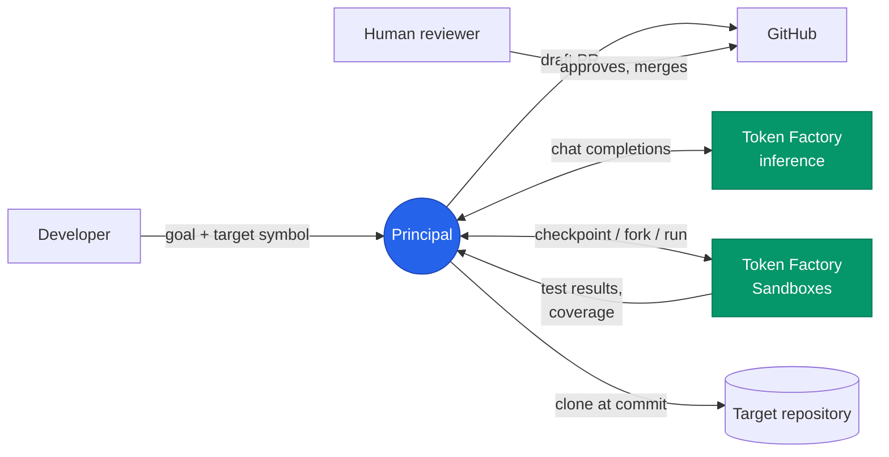
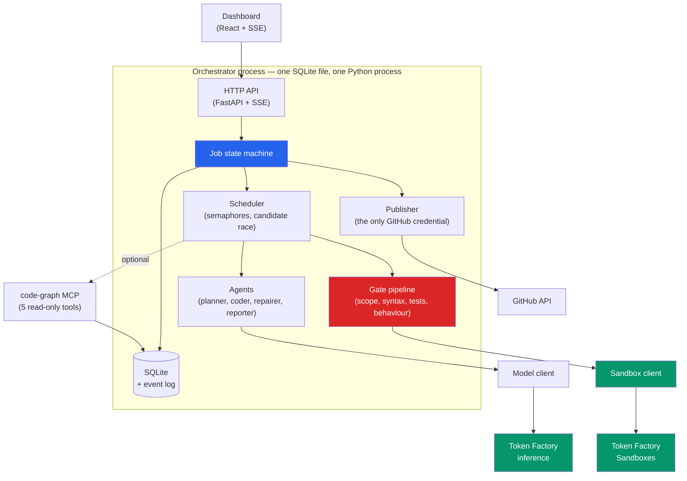
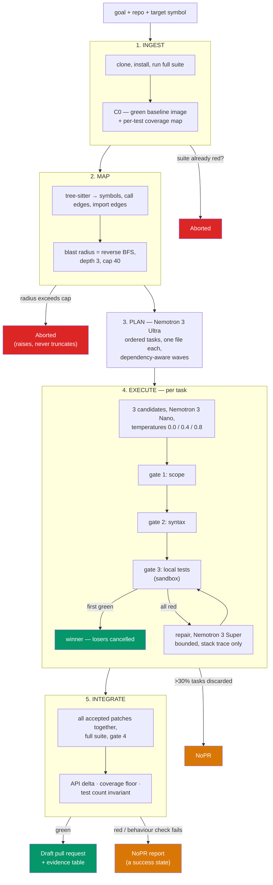
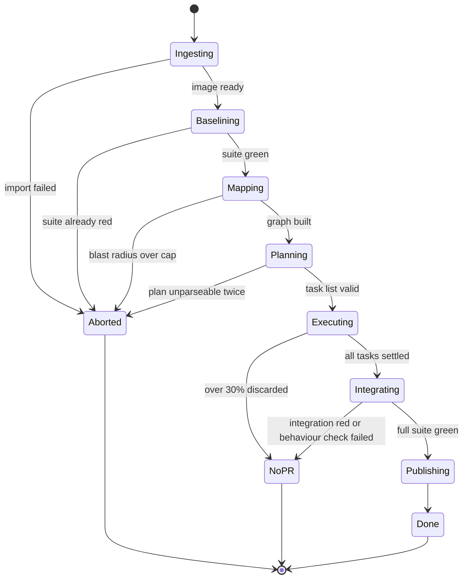
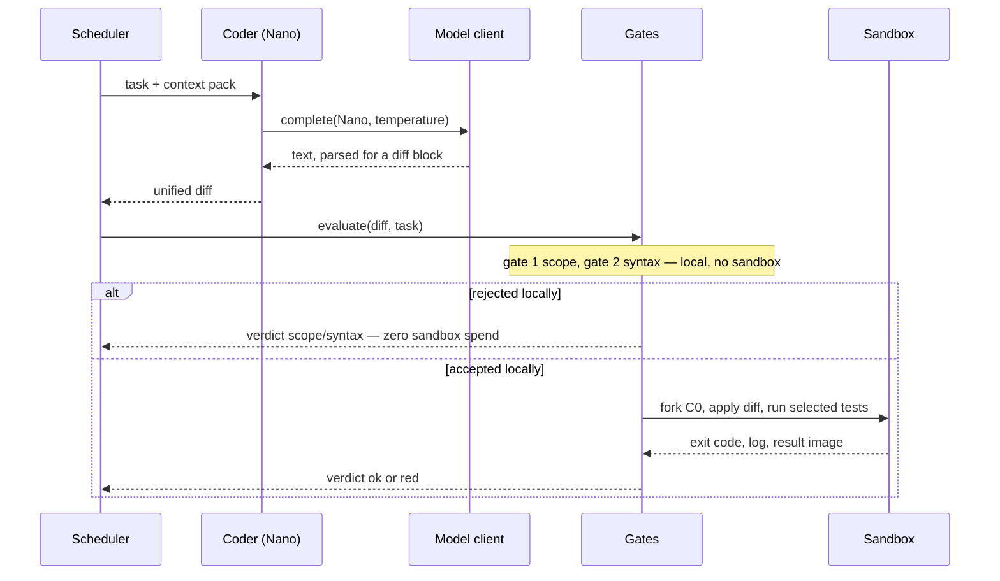

# Principal

**An autonomous technical debt remediation swarm. It refactors a real repository across dozens of files, and it will not open a pull request unless the tests are green.**

Built for the **[Nebius x NVIDIA Global AI Hackathon 2026](https://nebiusglobalaihackathon.devpost.com/)**.

| | |
|---|---|
| **Track** | **Coding and Agentic Engineering** — agents that write, run and test code in Token Factory Sandboxes |
| **Runs on** | Nebius Token Factory (inference + Sandboxes) |
| **Models** | NVIDIA Nemotron 3 — Nano 30B-A3B, Super 120B-A12B, Ultra 550B-A55B |
| **License** | Apache 2.0 |
| **Repository** | [github.com/BugHunterX2101/AMTDRS](https://github.com/BugHunterX2101/AMTDRS) |
| **Live demo** | **[amtdrs.onrender.com](https://amtdrs.onrender.com)** — runs with zero credentials against the bundled fixture; free-tier cold start after 15 min idle |
| **Demo video** | *(3 minutes — see [`docs/DEMO_VIDEO.md`](docs/DEMO_VIDEO.md) for the shot list)* |
| **Tests** | 108 passing · ruff clean · 3/3 architecture contracts held |

---

## The problem

Ask any coding agent to "remove this deprecated parameter" and it will do a good job on one file. The work that actually costs engineering teams money is the other kind: a signature change that touches forty call sites across nine modules, where being right in eight modules and wrong in the ninth is worse than not starting, because now someone has to review a large diff to find the one mistake.

Two things make that task hard for a single agent. It is **wide** — the context needed exceeds what fits usefully in one window — and it is **unverifiable by inspection** — the only honest signal about whether a refactor is correct is whether the test suite still passes. Frontier models score well above 80% on issue-resolution benchmarks and measurably worse on multi-file, behaviour-preserving refactors — the gap is a scaffolding problem, not purely a weights problem, and it is the gap this project is built to close.

## The approach

Principal replaces *one careful attempt* with *many cheap attempts and a hard gate*.

For each unit of work it generates several independent candidate patches in parallel, pushes each through four gates, and **races them: the first one to go green wins**. There is no scoring function and no model anywhere in the accept path — the decision is made by `pytest`, not by a language model. Candidates that lose are cancelled, and their failure costs nothing, because it happened inside a private sandbox that nobody ever sees.

This is affordable because of how the gates are ordered:

| Gate | What it proves | Where it runs | Cost |
|---|---|---|---|
| **1. Scope** | the patch only touches files the blast radius says it may | local | microseconds |
| **2. Syntax** | every changed file still parses | local, tree-sitter | milliseconds |
| **3. Local tests** | the tests that cover the changed code pass | Token Factory Sandbox | seconds |
| **4. Integration** | all accepted patches still pass together | Token Factory Sandbox, once | seconds |

Gates 1 and 2 never touch a sandbox. Most bad candidates die there, which is exactly what makes generous fan-out affordable — you can afford to be wrong eight times out of nine if eight of those failures are free.

### The guarantee

**Fail closed. No green test, no PR.**

`NoPR` is a success state, not a failure state. If Principal cannot verify the change, it stops and publishes a report explaining precisely where it stopped and what it tried. A refactoring tool that sometimes ships an unverified change is worth less than no tool at all, because it converts a bounded engineering task into an unbounded review task.

---

## Architecture

### System context



Principal never merges anything. The reviewer is inside the trust boundary by design, not an optional extra — every guarantee below assumes a human approves before code lands.

### Containers



Nine components in one process, one child process for MCP, one static frontend. Dependencies point downward only, enforced by `import-linter` in CI: `agents` cannot import `sandbox`, `gates` cannot import `models` or `agents`. The second rule is the architecture's central claim — **no model in the accept path** — expressed as something a machine checks rather than a sentence in a README.

### The verification pipeline



### Job state machine



`NoPR` is drawn with the same visual weight as `Done` throughout the dashboard, on purpose. It is a correct result — the system did its job and correctly declined to ship — and rendering it as an error would teach the opposite of the intended lesson.

### One attempt, in sequence



The `alt` branch is the cost model made visible. A rejected candidate spends one cheap completion and zero sandbox operations, which is why three candidates per task is affordable at all.

### Design decisions worth reading the code for

**The blast radius raises, it does not truncate.** A reverse-edge BFS over call and import edges, depth 3, capped at 40 files. If the radius exceeds the cap, Principal **aborts with `RADIUS_TOO_LARGE`** rather than silently working on the first 40 files. A truncated radius produces a patch that looks complete and is not, which is the single most dangerous failure mode this system could have.

**Unresolved call sites are reported, not hidden.** A dynamic dispatch — `registry[name](user)` — cannot be proved to reach the target. Principal lists these explicitly in the PR body under "what a human must check". Getting this list *short and honest* took real work: naive reporting floods it with builtins until it is ignored. `principal/graph/resolve.py` distinguishes a genuinely unresolvable dynamic call from `len()`, and on the bundled fixture that is the difference between 9 noise entries and exactly 2 real ones.

**Three behaviour-preservation checks beyond "tests pass".** Tests passing is necessary, not sufficient — a patch that deletes a function and its tests passes. So: public API delta is checked against the plan's *declared* removals, coverage may not fall, and the test count may not shrink.

**Per-test coverage drives test selection.** The baseline runs `pytest --cov-context=test`, which yields a test→line map. Each fork then runs only the tests that actually cover the lines it changed. This is what keeps gate 3 at seconds rather than minutes.

**The dependency rule is enforced by CI, not by discipline.** `agents` cannot import `sandbox`; `gates` cannot import `models` or `agents`. `import-linter` runs in CI (`lint-imports`, not `python -m importlinter.cli lint` — the latter silently exits 0 without evaluating a contract, which was caught and fixed during development).

**The event log is the product.** Every state change is an append-only row. The API streams it as SSE with `Last-Event-ID` resume, and every job writes a JSONL trace. A demo laptop that sleeps for ten seconds reconnects into a live view, not an empty one.

**Every safety claim has a fixture.** [`docs/THREAT_MODEL.md`](docs/THREAT_MODEL.md) states the threat matrix and residual risks explicitly, and `tests/unit/test_adversarial_corpus.py` asserts the exact gate verdict for 10 named adversarial diffs — including one that must pass, because a gate suite that only proves things get rejected is satisfied by a gate that rejects everything.

---

## How NVIDIA models and Nebius services are used

> *This section answers the hackathon's requirement to show how NVIDIA Nemotron and other NVIDIA open source models were used, where Token Factory accelerated the workflow, and which other Nebius tools and services the project depends on.*

### NVIDIA Nemotron 3 — a hybrid architecture, used the way it was designed to be used

Nemotron 3 is a **hybrid Mamba-Transformer Mixture-of-Experts** family: Mamba layers for linear-time long-range sequence modelling, Transformer layers for precise attention on code and math, and MoE routing so only a fraction of parameters activate per token. That combination is not incidental to this project — it is why wide fan-out over long, low-density prompts (a whole blast radius, every call site, with surrounding context) is economically viable at all. A pure quadratic-attention model at the same accuracy would cost far more per candidate.

Principal uses **three** tiers rather than one, because the work is genuinely three different jobs with three different cost-to-difficulty ratios. Every model call is tagged with its tier and its token cost is recorded in the run metadata, so the routing is measurable rather than asserted.

| Tier | Model | Scale | What it does | Why this tier |
|---|---|---|---|---|
| **Nano** | `nvidia/NVIDIA-Nemotron-3-Nano-30B-A3B` | 30B total, ~3.6B active | generates candidate patches; summarises failing test output | Candidate generation is the highest-volume call in the system — three per task, dozens per job — and the one where being wrong is cheapest, because gate 3 catches it. A ~3.6B active-parameter MoE makes wide fan-out economically possible; the whole design collapses if every candidate costs Ultra money. |
| **Super** | `nvidia/nemotron-3-super-120b-a12b` | 120B total, 12B active | repairs a candidate that failed its tests | Repair is narrow and well-specified — here is the diff, here is the failure, fix it — but needs real reasoning about *why* a test failed. Documented latent-MoE routing to ~4× the effective experts at the same inference cost buys that without Ultra's latency in a retry loop. |
| **Ultra** | `nvidia/Nemotron-3-Ultra-550b-a55b` | 550B total, 55B active | decomposes the goal into an ordered, dependency-aware task plan | Planning is called **once per job** and every downstream decision inherits its mistakes. This is the one place where paying the most for the best long-horizon reasoning is unambiguously correct. |

The planner tier is **configurable** (`PRINCIPAL_PLANNER_TIER=super|ultra`) specifically so the Super-versus-Ultra question can be *measured* on the benchmark rather than assumed — Super is documented for long-horizon agentic planning at a fraction of Ultra's active parameters, and `bench/` is built to answer whether that holds for this specific planning task rather than take the claim on faith.

#### The `reasoning_content` trap, and the boot-time capability probe

Reasoning models served over an OpenAI-compatible API can return their output in `reasoning_content` and leave `content` **empty**. Code that reads `choices[0].message.content` and trusts it gets an empty string, and — this is the part that costs a hackathon weekend — an empty string is not an error. It is a successful API call that silently produces nothing, so the failure surfaces three layers away as "the agent generated no patch".

Principal does not guess. At boot it runs a **3×3 capability probe**: each of the three models against each of the three output protocols (JSON schema / tool calls / fenced text), and pins each model to the protocol it actually demonstrated. The results are printed as a table at startup. `PRINCIPAL_FORCE_PROTOCOL` pins one protocol for everything if you need determinism.

```
model                                    schema  tools  text   chosen
nvidia/NVIDIA-Nemotron-3-Nano-30B-A3B    ok      ok     ok     schema
nvidia/nemotron-3-super-120b-a12b        ok      ok     ok     schema
nvidia/Nemotron-3-Ultra-550b-a55b        ok      ok     ok     schema
```

This turns an entire class of silent, misattributed failure into fifteen seconds of startup cost and a table you can read.

### Nebius Token Factory — Sandboxes, and why they are the whole design

Principal uses Token Factory for two distinct things.

**1. Inference** — the OpenAI-compatible endpoint at `https://api.tokenfactory.nebius.com/v1/`, which meant the entire model layer is the official `openai` Python SDK pointed at a different `base_url`. Zero custom HTTP client, zero bespoke retry logic, and rate-limit headroom read straight off the response headers via `with_raw_response`. The default allowance is **60 requests/min and 400,000 tokens/min**, scaling up 20% per 15-minute window sustained above 80% utilisation, to a ceiling of 20× base — which is exactly why the model client surfaces `x-ratelimit-remaining-*` headers live on the dashboard rather than discovering a slowdown by guessing.

**2. Sandboxes** — and this is not a convenience, it is the reason the architecture works at all.

Token Factory Sandboxes combine VM-level isolation with Git-like branching: fork from any checkpoint, run parallel explorations, roll back instantly. The Contree SDK exposes this as one primitive rather than separate `fork`/`checkpoint` calls — `image.run(shell=..., disposable=False)` returns a *new* image, and it is **content-addressed**:

```python
# Two runs of the identical command from the identical parent return the
# identical image UUID — no new execution, no new cost.
same1 = await image.run(shell="echo same", disposable=False)
same2 = await image.run(shell="echo same", disposable=False)
assert same1.uuid == same2.uuid
```

Two consequences fall directly out of that, and both are load-bearing:

- **Checkpoint-fork is the unit of state.** The green baseline `C0` is built once — clone, install, run the suite — and every candidate for every task forks from that same image. The expensive part (dependency installation, typically the dominant cost of any CI-like workload) is paid **once per job**, not once per candidate. With three candidates across a dozen tasks, that is the difference between one install and thirty-six.
- **Failure is free because it is private.** A candidate that breaks the build breaks *its own fork*. There is no shared mutable working tree to corrupt, no cleanup, no rollback, no interference between parallel attempts. This is what makes "generate three, race them, discard two" a reasonable thing to do rather than a reckless one.

The honest comparison: building this on ordinary containers would mean either serialising the work (losing the parallelism the whole thesis depends on) or re-installing dependencies per candidate (losing the economics). **Sandboxes accelerated the workflow by making the parallel search affordable, not merely by making it faster.** The image tree is also the dashboard's fork-tree visualisation — no extra bookkeeping, because `attempt.parent_image` and `attempt.result_image` already describe the graph the platform maintains.

Sandboxes are also where the correctness signal comes from at all: gates 3 and 4 are real `pytest` runs, on real installed dependencies, in an isolated microVM (separate kernel per command, full filesystem isolation, beta limit 50 concurrent operations, 180-day checkpoint retention for tagged images). The accept decision is a process exit code from a genuine test run — not a model's opinion of a diff.

### Other Nebius and NVIDIA components

| Component | Use |
|---|---|
| Token Factory OpenAI-compatible API | all inference; `openai` SDK with a changed `base_url` |
| Token Factory Sandboxes (`contree-sdk`) | baseline build, all four gates, integration verification |
| Token Factory rate-limit headers | live budget headroom, surfaced in `GET /jobs/{id}` and the dashboard |
| Token Factory model registry (`GET /v1/models`) | model ids resolved at boot, so a typo fails in five seconds rather than mid-job |
| NVIDIA Nemotron 3 Nano / Super / Ultra | candidates / repairs / planning |

Detailed, specific engineering feedback on all of the above — including the problems, several verified against the installed SDK source rather than the docs — is in **[`docs/FEEDBACK.md`](docs/FEEDBACK.md)**.

---

## Quickstart — no credentials needed

Principal runs end to end with **no Nebius account at all**, against a bundled 14-file fixture repository, using an in-process sandbox that executes real `git` and real `pytest`. This is how you verify the setup works before spending a token.

```bash
git clone https://github.com/BugHunterX2101/AMTDRS.git
cd AMTDRS

python -m venv .venv
source .venv/bin/activate          # Windows: .venv\Scripts\activate
pip install -e ".[dev]"

principal doctor
```

`doctor` checks the Python version, every import, the database schema, and — if credentials are present — inference, model ids and sandbox access. With no credentials you should see passes and three warnings:

```
  [PASS] python                     3.11.9 (need >= 3.11)
  [PASS] import tree_sitter         source parsing
  [PASS] import contree_sdk         Token Factory Sandboxes client
  [PASS] database                   principal.db — 12 tables, migrations applied
  [WARN] nebius_api_key             unset — Principal will run against the in-process FakeSandbox…
  doctor: ready
```

Now show the static analysis, which needs nothing but the source tree:

```bash
principal radius \
  --repo tests/fixtures/mini_repo \
  --commit deadbeef \
  --target src.auth.session.create
```

That prints the 7 files and 2 test files that a change to `create()` can reach, every call site with its confidence, and the 2 genuinely unresolvable dynamic dispatches — in about two seconds.

Then run a full job against the fixture:

```bash
principal run \
  --repo tests/fixtures/mini_repo \
  --commit deadbeef \
  --target src.auth.session.create \
  --goal "make ttl keyword-only and update every call site" \
  --fake-sandbox
```

And the tests:

```bash
make test          # or: pytest — 108 tests, unit + integration
make lint          # ruff + import-linter (the architecture contracts)
```

## Full setup — with Nebius Token Factory

```bash
cp .env.example .env
```

Fill in two values:

| Variable | Where it comes from | Notes |
|---|---|---|
| `NEBIUS_API_KEY` | Token Factory console → API keys | Used for inference **and**, by default, as the Sandboxes bearer token. |
| `NEBIUS_PROJECT_ID` | Token Factory console → your project | Sent as the mandatory `Project` header by the Contree SDK. |

> **Sandbox access is granted per project, not per key.** A key that does inference perfectly may still get `403` on Sandboxes. This is the single most common setup failure, which is why `principal doctor` probes them as two separate checks — it does one trivial disposable sandbox run and tells you which of the two is broken. If your account issues a **separate** Sandboxes token, set `CONTREE_TOKEN`; it is preferred over `NEBIUS_API_KEY` automatically for every sandbox call.

Then:

```bash
principal doctor          # expect PASS on inference, all three models, and sandboxes
principal serve           # http://127.0.0.1:8000
```

### Optional: opening pull requests

Principal only opens a PR when gate 4 is green. To enable it:

| Variable | Value |
|---|---|
| `GITHUB_TOKEN` | A **fine-grained** token with exactly `contents: write` and `pull_requests: write` |
| `PRINCIPAL_FORK_REPO` | `owner/name` of the fork Principal pushes branches to |

> **Scope the token to a fork you own — never to an upstream repository.** Principal opens **draft** PRs only. Leave both unset and jobs still run to completion and still produce the full verification report; only the publish step is skipped.

## Running it

### HTTP API

```bash
principal serve --host 0.0.0.0 --port 8000
```

| Method | Path | Purpose |
|---|---|---|
| `GET` | `/healthz` | liveness + what the process is actually configured to talk to |
| `POST` | `/jobs` | start a job — returns `202` and an SSE stream URL |
| `GET` | `/jobs/{id}` | state, counts, token budget, live rate-limit headroom |
| `GET` | `/jobs/{id}/events` | SSE, resumable via `Last-Event-ID` |
| `GET` | `/jobs/{id}/tree` | the sandbox fork tree |
| `GET` | `/artifacts/{id}` | any diff, test log or report by id |
| `POST` | `/jobs/{id}/cancel` | cancels in-flight sandbox operations too |
| `GET` | `/debug/blast-radius` | blast radius of any symbol, no job required |

```bash
curl -X POST localhost:8000/jobs -H 'content-type: application/json' -d '{
  "repo_url": "tests/fixtures/mini_repo",
  "commit_sha": "deadbeef",
  "target_fqn": "src.auth.session.create",
  "goal": "make ttl keyword-only and update every call site"
}'
```

### Dashboard

Served at `/` by `principal serve` once built:

```bash
cd dashboard && npm install && npm run build
```

It renders the live fork tree, per-candidate gate progress, an evidence drawer (diff, test output, coverage delta for any attempt) and the NoPR report. `PRINCIPAL_SLOW_MO_MS=250` paces event emission so the fan-out is legible on video.

### Code-graph MCP server

The static analysis is exposed as five read-only MCP tools (`find_symbol`, `callers_of`, `blast_radius`, `tests_covering`, `read_span`), mounted by `principal serve` and usable from any MCP client. Every tool is read-only by construction — there is no write tool, no shell tool, and nothing that names a sandbox, so an agent holding this toolset can look at the code and nothing else.

### Benchmark

```bash
make bench
```

Three arms over the same task set: **A** single-shot, no gates; **B** single candidate, gates on; **C** full swarm. Results are reported in **three** buckets — verified / failed on merit / excluded as infrastructure — because collapsing a sandbox timeout into "the patch was wrong" is dishonest in both directions: it understates the verified refactor rate and it hides a platform problem that belongs in the tooling feedback.

## Deploying the hosted demo

Because the app runs with no credentials against the bundled fixture, any container host works:

```bash
docker build -t principal .
docker run -p 8000:8000 principal
```

With credentials, pass them through:

```bash
docker run -p 8000:8000 -e NEBIUS_API_KEY=... -e NEBIUS_PROJECT_ID=... principal
```

**Live free-tier deploy:** a `render.yaml` Blueprint is included and is what serves [amtdrs.onrender.com](https://amtdrs.onrender.com) — Render builds the exact Dockerfile above with no credit card required and auto-deploys on every push to `main`. See [`docs/DEPLOY.md`](docs/DEPLOY.md) for the setup steps, and why Cloud Run and Hugging Face Spaces were tried first and ruled out for a genuinely zero-cost path on this account.

---

## Repository structure

```text
AMTDRS/
├── principal/                       the orchestrator — one process, one SQLite file
│   ├── cli.py                       serve | doctor | run | radius
│   ├── config.py                    every tunable, recorded into each job's metadata
│   ├── errors.py                    error taxonomy — retryable? system's fault or platform's?
│   ├── diffs.py                     sentinel extraction + unified-diff parsing (no model here)
│   │
│   ├── db/
│   │   ├── schema.sql                code graph + run-record tables
│   │   ├── store.py                  typed row access, no ORM
│   │   └── events.py                 append event + row, one transaction — the event log is the product
│   │
│   ├── graph/                        tree-sitter parsing → the code graph
│   │   ├── languages/                grammar registry (python.scm, typescript.scm)
│   │   ├── parse.py                  tree-sitter wrapper, query execution
│   │   ├── build.py                  two-pass construction: symbols, then edges
│   │   ├── resolve.py                static vs. heuristic callee resolution
│   │   ├── radius.py                 reverse-edge BFS, depth 3, cap 40 — raises, never truncates
│   │   └── embed.py                  convention examples only
│   │
│   ├── sandbox/                      Contree SDK wrapper — the only writes in the system
│   │   ├── client.py                 operation-id capture for cancellation + crash recovery
│   │   ├── baseline.py               C0 construction, tagging, coverage
│   │   ├── fake.py                   in-process sandbox with real content-addressed semantics
│   │   ├── runner.py                 one run per attempt, sentinel parsing
│   │   └── scripts.py                shell templates, one per phase
│   │
│   ├── models/                       Token Factory client
│   │   ├── registry.py               resolve model ids against list-models
│   │   ├── probe.py                  the 3×3 capability probe
│   │   ├── protocols.py              schema / tools / text adapters
│   │   ├── client.py                 budget, retries, reasoning_content extraction
│   │   └── cache.py                  content-addressed disk cache
│   │
│   ├── agents/                       one pure function per role, no shared memory
│   │   ├── contracts.py              pydantic models, repair-kind taxonomy
│   │   ├── planner.py                Ultra — goal → ordered task list
│   │   ├── coder.py                  Nano — task → unified diff
│   │   ├── repairer.py               Super — failing diff + stack trace → revised diff
│   │   ├── reporter.py               artifacts → PR title/body/risk list
│   │   └── prompts/*.md
│   │
│   ├── gates/                        deterministic, total, never raises
│   │   ├── pipeline.py               the Verdict type + ordering
│   │   ├── scope.py                  gate 1 — local
│   │   ├── syntax.py                 gate 2 — local
│   │   ├── tests.py                  gate 3 — selection + sandbox run
│   │   ├── apply.py                  diff application onto the local snapshot
│   │   └── behaviour.py              API delta, coverage floor, test-count invariant
│   │
│   ├── orchestrator/
│   │   ├── job.py                    the state machine
│   │   ├── scheduler.py              semaphores, the candidate race, first-green-wins
│   │   ├── ordering.py               topological + file-conflict wave splitting
│   │   └── budget.py                 reserve-and-refuse, never truncate
│   │
│   ├── publish/
│   │   ├── github.py                 the only GitHub-credential holder, one call site
│   │   └── prbody.py                 evidence-table PR body
│   │
│   └── api/
│       ├── app.py                    FastAPI, lifespan (capability probe, sandbox probe, MCP mount)
│       ├── routes.py                 the eight endpoints incl. /healthz
│       ├── stream.py                 SSE from the event table
│       └── schemas.py                request/response models
│
├── mcp_code_graph/                  5 read-only MCP tools over the code graph
│   ├── server.py                     FastMCP adapter, session-scoped
│   └── tools.py                      find_symbol, callers_of, blast_radius, tests_covering, read_span
│
├── dashboard/                        React + Vite, SSE client
│   └── src/
│       ├── App.jsx                   layout: job form, pipeline, fork tree, evidence drawer
│       ├── components.jsx            Masthead, TaskBoard, ForkTree, Outcome, EvidenceDrawer…
│       └── useJobStream.js           the event-log reducer — resumable via Last-Event-ID
│
├── bench/                            three arms, honest three-bucket scoring
│   ├── harness.py                    drives real run_job() per (task, arm), independent re-verification
│   ├── arms.py                       A: no gates · B: gates, one candidate · C: full swarm
│   ├── score.py                      verified / failed-on-merit / excluded-as-infrastructure
│   └── tasks.json                    pinned task definitions, published
│
├── spikes/                           throwaway, answer-one-question scripts
│   ├── spike_sandbox.py              sandbox reachability, content-addressed dedup, cancellation
│   └── spike_protocol.py             the 3×3 capability probe, standalone with raw response inspection
│
├── tests/
│   ├── conftest.py                   hermetic fixtures — temp DB, FakeSandbox, no network
│   ├── fixtures/
│   │   ├── mini_repo/                14 files: 9 call sites, 1 aliased import, 1 dynamic dispatch,
│   │   │                             1 uncovered private symbol, 14 passing tests
│   │   └── diffs/                    the adversarial corpus — 10 named fixtures, exact verdicts
│   ├── unit/                         gates, radius, ordering, MCP tools, bench scoring, adversarial corpus
│   └── integration/                  real baseline → coverage → attempt pipeline against FakeSandbox
│
├── docs/
│   ├── PRD.md                        product requirements
│   ├── DESIGN.md                     engineering design document
│   ├── SPEC.md                       technical specification
│   ├── THREAT_MODEL.md               threat matrix + residual risks, stated explicitly
│   ├── FEEDBACK.md                   Nebius/NVIDIA tooling feedback, verified against installed SDKs
│   ├── SUBMISSION.md                 Devpost text + requirement-by-requirement checklist
│   ├── DEMO_VIDEO.md                 3-minute shot list and script
│   └── DEPLOY.md                     Render.com deployment steps
│
├── Dockerfile                        two-stage build (dashboard, then API) — serves with zero credentials
├── render.yaml                       Render Blueprint — what deploys amtdrs.onrender.com
├── Makefile                          install · doctor · test · lint · bench · demo · docker
├── pyproject.toml                    deps, ruff config, import-linter contracts
├── LICENSE                           Apache-2.0, verbatim, detectable by GitHub's own scanner
└── NOTICE                            third-party licenses, trademark attribution
```

---

## Safety

- **Draft PRs only.** A human merges.
- **Never pushes to upstream.** The token is scoped to a fork; this is documented in `.env.example` and enforced by configuration.
- **Sandboxed execution.** All generated code runs in an isolated Token Factory microVM, never on the host.
- **Scope gate.** A patch that touches a file outside its blast radius is rejected before it runs. Dependency manifests and test files are separately blocked, so a candidate cannot make itself pass by editing the tests.
- **Fail closed.** No green test, no PR — always.
- **Every claim named and tested.** [`docs/THREAT_MODEL.md`](docs/THREAT_MODEL.md) states the residual risks a verification system this size cannot fully close (an untested private symbol can still be deleted; sandbox network egress is not yet disabled by the platform SDK) rather than implying there are none.

## Project provenance

Principal was **created entirely during the hackathon submission period** (26 August – 30 October 2026). It is not a pre-existing project, and no part of it was published before the submission period opened. The full commit history in this repository is the record.

## Documentation

| Document | Contents |
|---|---|
| [`docs/FEEDBACK.md`](docs/FEEDBACK.md) | Engineering feedback on Token Factory, Sandboxes, Nemotron 3 and the SDKs |
| [`docs/THREAT_MODEL.md`](docs/THREAT_MODEL.md) | Threat matrix, trust boundaries, residual risks stated explicitly |
| [`docs/SUBMISSION.md`](docs/SUBMISSION.md) | The Devpost submission text and the requirement-by-requirement checklist |
| [`docs/DEMO_VIDEO.md`](docs/DEMO_VIDEO.md) | Shot list and script for the three-minute demo |
| [`docs/DEPLOY.md`](docs/DEPLOY.md) | Deploying the hosted demo on Render's free tier |
| [`docs/PRD.md`](docs/PRD.md) | Product requirements |
| [`docs/DESIGN.md`](docs/DESIGN.md) | Engineering design document |
| [`docs/SPEC.md`](docs/SPEC.md) | Technical specification |

## License

Apache License 2.0 — see [`LICENSE`](LICENSE) and [`NOTICE`](NOTICE).
