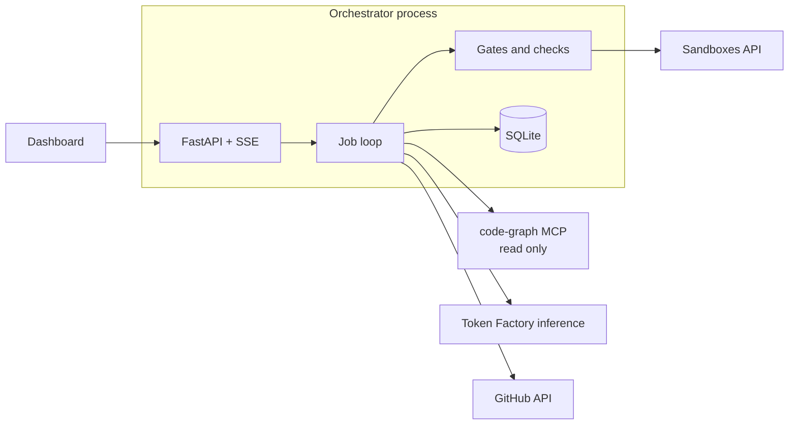
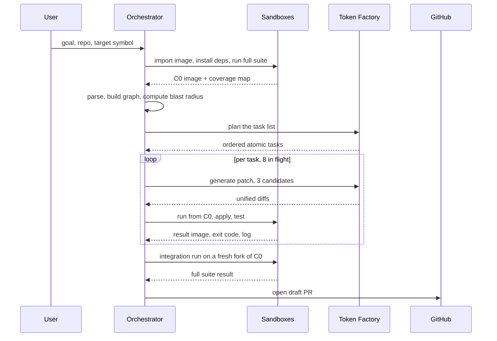
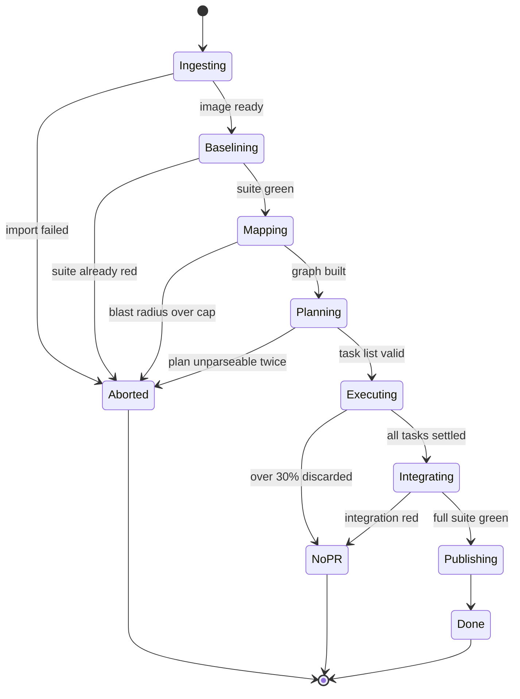

# Principal: engineering design document

2026-09-18 · @Someone

This document turns the Principal PRD into buildable specifics: process boundaries, schemas, tool contracts, and an implementation order. The PRD decides what Principal is and why. This decides how it is built and what a developer types first.

## Design goals and constraints

This document decides five things the PRD left open: what a checkpoint actually is on this platform, where run state lives, how agents get structure when the models may not support tool calling, where permission checks physically sit, and what gets built in what order.

Research since the PRD moved three of its assumptions. All three are load-bearing, so they come first.

### Three corrections to the PRD

**There is no fork call, and that is better than expected.** The PRD's sandbox tool list assumed explicit `fork_checkpoint` and `checkpoint` operations. The real API has neither. In the Contree SDK, [branching is running a command twice from the same parent image](https://docs.tokenfactory.nebius.com/sandboxes/sdk/python_sdk/branching.md): `image.run(shell=..., disposable=False)` returns a new image whose UUID is the checkpoint. Every non-disposable run is a checkpoint, and forking is just calling `run()` on the same parent again. One further property matters a lot: [running the same command twice from the same parent returns the same UUID](https://docs.tokenfactory.nebius.com/sandboxes/sdk/python_sdk/branching.md), so the state graph is content-addressed and repeated work is deduplicated for free.

**Tool calling on Nemotron is the biggest technical risk in the project.** Token Factory documents [function calling with `tool_choice` forcing](https://docs.tokenfactory.nebius.com/ai-models-inference/function-calling.md) and [JSON schema output via `response_format`](https://docs.tokenfactory.nebius.com/ai-models-inference/json.md), but support is per-model, not platform-wide. A Nebius API issue filed in May 2026 reports that [all three Nemotron models served on Token Factory are reasoning models that return an empty `content` field with the text in `reasoning_content`, and that tool calls return 400 through the OpenAI-compatible wrapper](https://github.com/nebius/api/issues/211). If that is still true in October, an MCP design that assumes native tool calling does not run at all. Section 6 designs around it rather than hoping.

**Over 7,000 SWE environments are preloaded.** The PRD ranks test-environment setup as high likelihood and severe impact. Sandboxes ships [more than 7,000 ready-to-run SWE environments, including SWE-bench Verified, SWE-rebench and SWE-rebench-V2](https://docs.tokenfactory.nebius.com/sandboxes/swe-agents.md), explicitly built for branching search strategies. That deletes most of the risk for anything drawn from those datasets. It does not cover SWE Atlas Refactoring, which is not in the catalog, so the benchmark choice now has a real trade-off attached.

### Hard constraints

| Constraint | Value | Where it comes from |
| --- | --- | --- |
| Concurrent sandbox operations | 50, beta limit | [Sandboxes beta limitations](https://docs.tokenfactory.nebius.com/sandboxes/overview) |
| Checkpoint retention | 180 days, untagged unreferenced images may be deleted | [Sandboxes beta limitations](https://docs.tokenfactory.nebius.com/sandboxes/overview) |
| Inference endpoint | `api.tokenfactory.nebius.com/v1`, OpenAI wire format | [Token Factory structured output docs](https://docs.tokenfactory.nebius.com/ai-models-inference/json.md) |
| Credentials | Sandbox and inference tokens may differ, sandbox needs a project header | [Live sandbox verification notes](https://github.com/kreuzhofer/nebius-token-factory-sandbox-demos) |
| Sandbox process model | Each execution gets its own VM, no long-lived process between runs | [Live sandbox verification notes](https://github.com/kreuzhofer/nebius-token-factory-sandbox-demos) |
| Deadline | 30 October 2026, demo video under three minutes | PRD |
| Team and time | One person, evenings, alongside coursework | PRD |
| Local machine | RTX A5000 on Windows, no WSL, nothing heavy runs locally | PRD |
| Repository scope | Python and TypeScript, up to 2,000 files, interface evolution only | PRD |

The 50-operation cap is worth noting rather than worrying about. Eight parallel forks with a handful of test runs each sits comfortably inside it, and the cap only becomes a design question if the benchmark harness runs many jobs at once. It does, so section 11 serialises benchmark jobs deliberately.

### What this design optimises for

In priority order, and the order matters because these conflict: a working demo by week three, then verifiable claims, then cost, then breadth. Anything that trades a week of schedule for a nicer abstraction loses. Anything that trades correctness for speed also loses, because the entire pitch is that this system does not ship unverified changes.

## Runtime topology

One orchestrator process, one read-only MCP server, three external APIs, and a static dashboard. Agents never run inside a sandbox, and the sandbox never reaches a model. Those two facts are the whole security story and they also make the system far easier to debug.



### The one change from the PRD's tool surface

The PRD gives the Coder agent a sandbox MCP server with `apply_patch` and `run_tests`, and enforces scope inside `apply_patch`. Drop that. The Coder gets no write tools at all: it returns a unified diff as its output and the orchestrator applies it, tests it, and judges it.

Three reasons, in order of weight. It removes the possibility of an agent reaching the sandbox at all, which is stronger than rejecting its calls. It removes the Coder's dependence on native tool calling, which is the single largest technical risk in the project. And it is less code, because the apply-and-test path is already the gate pipeline and does not need a second implementation behind a tool boundary.

The cost is that the Coder cannot iterate inside its own fork. That is fine: iteration is the Repairer's job, and the Repairer gets the test output handed to it rather than fetching it.

### Processes and what each one holds

| Process | Owns | Credentials it holds | Where it runs |
| --- | --- | --- | --- |
| Orchestrator | Job loop, gates, SQLite, trace writer, SSE stream | All of them | Local in dev, Serverless Endpoint for the demo |
| code-graph MCP | Read-only queries over the graph and the repo snapshot | None | Child process over stdio, same host |
| Dashboard | Rendering the event stream | None | Static build served by the orchestrator |
| Sandboxes | Running the repository's own tests | None, and no outbound network | Nebius microVMs |

The credential column is the important one. The GitHub token lives in one place, is used by exactly one function, and that function runs only after the integration gate has passed. No agent, no MCP server and no sandbox can reach it.

### Why the sandbox is not an agent tool

Contree ships [its own MCP server](https://docs.tokenfactory.nebius.com/sandboxes/mcp/index.md) with `run`, `upload`, `read_file`, `grep` and operation management. It is genuinely useful and it is the wrong thing to hand an agent here. Those tools are general-purpose by design, and a general-purpose `run` tool inside the loop means an agent can execute anything, which discards every guarantee in the PRD's safety section.

Use the Contree SDK from the orchestrator instead, and keep the MCP surface for the read-only code graph where a general-purpose tool is harmless. Say this explicitly in the write-up, because using a sponsor's MCP server and then explaining why you deliberately did not expose it to the agents is a stronger answer than using it uncritically.

### Local development and the hosted build

Nothing heavy runs locally, which the PRD already identified as a fit for the no-WSL constraint. In development the orchestrator runs on the Windows machine with `uvicorn`, the dashboard runs under Vite against it, and both sandbox and inference calls go out over HTTPS. For the hosted demo the same process runs on a Serverless Endpoint with the dashboard's static build mounted, so there is no second deployment target and no environment divergence to debug in week five.

## Data model

One SQLite file per installation, holding two unrelated things: the code graph, which is derived and disposable, and the run record, which is the evidence and must never be lost. Blobs live on disk and SQLite holds only their index, so a run directory can be zipped and published as-is.

### Code graph

```sql
CREATE TABLE file (
  id        INTEGER PRIMARY KEY,
  path      TEXT NOT NULL UNIQUE,
  lang      TEXT NOT NULL CHECK (lang IN ('python', 'typescript')),
  sha256    TEXT NOT NULL,
  is_test   INTEGER NOT NULL DEFAULT 0
);

CREATE TABLE symbol (
  id          INTEGER PRIMARY KEY,
  fqn         TEXT NOT NULL,
  kind        TEXT NOT NULL,          -- function | class | method | const | type
  file_id     INTEGER NOT NULL REFERENCES file(id),
  line_start  INTEGER NOT NULL,
  line_end    INTEGER NOT NULL,
  signature   TEXT,
  exported    INTEGER NOT NULL DEFAULT 0
);
CREATE UNIQUE INDEX symbol_fqn_file ON symbol(fqn, file_id);

CREATE TABLE import_edge (
  file_id        INTEGER NOT NULL REFERENCES file(id),
  symbol_name    TEXT NOT NULL,
  source_module  TEXT NOT NULL,
  resolved_symbol_id INTEGER REFERENCES symbol(id),
  line           INTEGER NOT NULL
);

CREATE TABLE call_edge (
  caller_symbol_id INTEGER REFERENCES symbol(id),
  callee_symbol_id INTEGER REFERENCES symbol(id),
  file_id          INTEGER NOT NULL REFERENCES file(id),
  line             INTEGER NOT NULL,
  confidence       TEXT NOT NULL CHECK (confidence IN ('static', 'heuristic'))
);

CREATE TABLE test_edge (
  test_file_id INTEGER NOT NULL REFERENCES file(id),
  symbol_id    INTEGER NOT NULL REFERENCES symbol(id),
  source       TEXT NOT NULL CHECK (source IN ('import', 'coverage'))
);
```

Two columns carry real design weight.

`call_edge.confidence` exists because dynamic dispatch cannot be resolved statically. A `getattr` call, a string-keyed registry or a re-exported alias produces a heuristic edge, not a static one. Heuristic edges are included in the blast radius and listed separately in the PR's risk section, which is the honest version of the PRD's claim that call sites are enumerated exactly. They are enumerated exactly for the static subset and flagged for the rest.

`test_edge.source` allows the tests relation to be built two ways. The static way is imports in the test file. The much better way is a coverage run, and the baseline suite already runs once to establish the green checkpoint, so collecting per-test coverage there costs one flag and no extra wall clock. Coverage-derived edges catch tests that exercise a symbol through three layers of indirection, which is exactly where the static version silently misses.

### Run record

```sql
CREATE TABLE job (
  id             TEXT PRIMARY KEY,        -- ULID, sorts by time
  repo_url       TEXT NOT NULL,
  commit_sha     TEXT NOT NULL,
  goal           TEXT NOT NULL,
  target_fqn     TEXT,
  state          TEXT NOT NULL,
  baseline_image TEXT,                    -- Contree image UUID for C0
  token_budget   INTEGER NOT NULL,
  tokens_spent   INTEGER NOT NULL DEFAULT 0,
  created_at     TEXT NOT NULL,
  finished_at    TEXT,
  stop_reason    TEXT
);

CREATE TABLE task (
  id           TEXT PRIMARY KEY,
  job_id       TEXT NOT NULL REFERENCES job(id),
  seq          INTEGER NOT NULL,
  target_file  TEXT NOT NULL,
  instruction  TEXT NOT NULL,
  acceptance   TEXT NOT NULL,
  depends_on   TEXT,                      -- JSON array of task ids
  state        TEXT NOT NULL,
  attempts     INTEGER NOT NULL DEFAULT 0,
  winning_attempt_id TEXT
);

CREATE TABLE attempt (
  id            TEXT PRIMARY KEY,
  task_id       TEXT NOT NULL REFERENCES task(id),
  n             INTEGER NOT NULL,
  model         TEXT NOT NULL,
  temperature   REAL NOT NULL,
  parent_image  TEXT NOT NULL,            -- the image this forked from
  result_image  TEXT,                     -- the image the run produced
  diff_sha256   TEXT,
  verdict       TEXT,                     -- green | scope | syntax | red | error
  exit_code     INTEGER,
  duration_ms   INTEGER,
  prompt_tokens INTEGER,
  completion_tokens INTEGER
);

CREATE TABLE artifact (
  id         TEXT PRIMARY KEY,
  job_id     TEXT NOT NULL REFERENCES job(id),
  attempt_id TEXT REFERENCES attempt(id),
  kind       TEXT NOT NULL,   -- diff | test_log | model_call | coverage | api_snapshot
  path       TEXT NOT NULL,   -- relative to runs/<job_id>/
  sha256     TEXT NOT NULL,
  created_at TEXT NOT NULL
);

CREATE TABLE event (
  seq     INTEGER PRIMARY KEY AUTOINCREMENT,
  job_id  TEXT NOT NULL REFERENCES job(id),
  ts      TEXT NOT NULL,
  kind    TEXT NOT NULL,
  payload TEXT NOT NULL       -- JSON
);
```

### Why `attempt` stores two image UUIDs

Because the sandbox state graph is content-addressed, `parent_image` and `result_image` are enough to reconstruct the entire branch tree of a job after the fact, from the database alone, with no extra bookkeeping. The dashboard's branch view, the audit trail, and the claim that every result is traceable to a sandbox operation all fall out of those two columns.

It also gives free deduplication. Two attempts that produce byte-identical commands from the same parent resolve to the same image, so a retried baseline or a re-run benchmark task costs nothing the second time.

### The event table is the product

Everything the dashboard renders, every trace file published with the submission, and every claim in the PR body reads from `event`. It is append-only, monotonically sequenced, and never updated. Server-sent events stream straight out of it, and a reconnecting client resumes from its last `seq` rather than replaying the job.

One rule that is easy to break and expensive to fix later: no code path writes to `job`, `task` or `attempt` without writing a matching `event` in the same transaction. If those two ever disagree, the trace stops being evidence.

## Job lifecycle

The PRD describes the attempt-level loop. This is the level above it: what the orchestrator does from the moment a goal arrives to the moment a PR exists or does not.



### Job states



`NoPR` is a success state, not a failure state. It means the system did its job and correctly declined to ship. The dashboard renders it in the same weight as `Done`, and the demo deliberately shows it at least once.

`Baselining` aborting on an already-red suite is the cheapest guardrail in the system. A repository whose tests do not pass before Principal touches it makes every downstream claim meaningless, and finding out at the start costs one test run that was going to happen anyway.

### Concurrency and budget

| Control | Mechanism | Value |
| --- | --- | --- |
| Parallel tasks | `asyncio.Semaphore` around the task coroutine | 8 |
| In-flight sandbox operations | Global semaphore, separate from the task one | 24, well under the platform's 50 |
| Attempts per task | Counter on `task.attempts` | 3, meaning one try plus two repairs |
| Tokens per job | Checked before every model call against `job.token_budget` | Set per job, default sized from a week-two measurement |
| Wall clock per task | `asyncio.wait_for` around the whole task | 5 minutes |

Tasks that write the same file are never run in parallel. The planner emits `depends_on`, and the scheduler additionally serialises any two tasks sharing a `target_file` even when the planner did not say so. Relying on the model to notice the conflict is the wrong place for that check.

Budget is enforced at the call site, not at a reporting layer. The model client refuses a call that would exceed the remaining budget and raises, the task fails closed, and the job moves to `NoPR` rather than truncating silently. Running out of credits mid-benchmark is on the PRD's risk list, and this is the code that makes it a clean stop instead of a confusing one.

### Crash recovery

This comes almost free from the platform and is worth building because the demo depends on it. Images are durable for 180 days, so restart recovery is a database read rather than a re-execution.

1. Reload the job. `baseline_image` is the C0 UUID, still valid.
2. Any `attempt` with a `result_image` and a verdict is finished. Keep it.
3. Any task not in a terminal state goes back on the queue with its attempt counter intact.
4. Re-running an identical command from the same parent returns the same image without executing it again, so replayed work is free rather than merely idempotent.

The one thing that needs explicit handling is an operation that was in flight when the process died. Sandbox operations are async with polling and cancellation, so store the operation id on the attempt when it starts. On restart, poll each stored id: terminal operations are folded into the attempt as normal, and running ones are either awaited or cancelled depending on whether the job is resuming or being abandoned. Without the stored id, orphaned operations keep consuming the concurrency budget until they time out.

## Sandbox and checkpoint design

Contree has one primitive and it is not the one the PRD assumed. An image handle plus a command produces a new image. That is the checkpoint, the fork, and the result, all at once.

| Principal concept | Contree primitive |
| --- | --- |
| Baseline C0 | The image returned by the run that installed dependencies and passed the suite |
| Forking a candidate | Calling `run()` on the C0 image again |
| Checkpoint | Any image UUID from a run with `disposable=False` |
| Discarding a candidate | Doing nothing. The image is simply never referenced again |
| Rollback | Using the parent image UUID, which never changed |

Discarding costs nothing because nothing was mutated. This is the part worth explaining slowly in the video, and it is more impressive stated as a property than as a feature: there is no undo path in Principal because there is no mutation to undo.

### Building the baseline

```python
sdk = Contree(api_client)
base = await sdk.images.use("python:3.11-slim")

setup = await base.run(
    shell=(
        "git clone --depth 1 $REPO /work && cd /work && "
        "git checkout $SHA && pip install -e '.[test]' && "
        "pytest --cov --cov-report=json:/work/.principal/coverage.json -q"
    ),
    disposable=False,
)
# setup.uuid is C0. Tag it so retention does not collect it.
```

Two things about this block matter more than the code. Dependency installation happens exactly once per repository and commit, which is where most of the wall-clock saving comes from. And the coverage report produced here is what populates `test_edge`, so the tests relation is a by-product of a run that had to happen anyway.

Tag C0 with `principal/<repo>@<sha>`. Untagged unreferenced images are eligible for deletion under the beta retention policy, and an untagged baseline that disappears between the benchmark run and the demo recording would be an unpleasant surprise.

### One run per attempt, not three

Each execution gets its own VM and no process survives between runs, so every run must be self-contained. The temptation is to chain runs: one to apply the patch, one to check syntax, one to test. Do not. Each extra run is another VM spin-up for no added information.

The better split is that most gates never reach the sandbox at all. The orchestrator holds the repo snapshot already, because it parsed it to build the graph. So it can apply the diff locally, check that it touches only permitted paths, and re-parse the patched file with tree-sitter, all before spending a sandbox operation.

| Gate | Where it runs | Cost |
| --- | --- | --- |
| Scope | Orchestrator, on the diff text | Microseconds |
| Syntax | Orchestrator, tree-sitter on the locally patched file | Milliseconds |
| Local tests | Sandbox, one run from C0 | One operation |
| Integration | Sandbox, one run from a fresh C0 | One operation per job |

Most bad candidates therefore die without ever touching Nebius. That is the real reason generous parallelism is affordable, and it is a sharper version of the PRD's cost argument.

### The attempt run

The patch goes in as a base64 heredoc rather than an upload, because a single-file diff is small and an upload is a second round trip.

```python
script = (
    "cd /work && "
    f"echo {b64_diff} | base64 -d > /tmp/p.diff && "
    "git apply --check /tmp/p.diff && git apply /tmp/p.diff && "
    f"pytest {' '.join(selected_tests)} -q --json-report "
    "--json-report-file=/tmp/result.json; "
    "echo __PRINCIPAL__; cat /tmp/result.json"
)
attempt_image = await c0.run(shell=script, disposable=False, network=False)
```

The sentinel line separates test chatter from the machine-readable result, so parsing never depends on pytest's stdout format. Networking is off for attempt runs, which is what makes the PRD's secret-exfiltration mitigation structural rather than aspirational.

`selected_tests` comes from the `test_edge` table, not from running everything. This is the single largest lever on job wall clock, and it is why the coverage-derived edges are worth collecting at baseline.

### Operations, streaming and timeouts

Sandbox work is represented as an operation with polling, cancellation and a server-sent event stream of its log. Three consequences for the design.

Store the operation id on the attempt the moment it starts, for the crash-recovery path in the previous section. Stream the operation's event log straight through to the dashboard rather than waiting for the run to finish, because watching tests scroll inside a fork is most of the demo's texture. And set both bounds: a server-side execution timeout so a hung test cannot hold an operation slot forever, and a local `asyncio.wait_for` that cancels the operation when the orchestrator gives up first.

### Benchmark environments

For anything drawn from SWE-bench Verified, SWE-rebench or SWE-rebench-V2, skip this section's setup entirely and use a preloaded environment. Over 7,000 ship with the platform, which removes the repository-setup work that the PRD flags as a high-likelihood schedule risk. Build images by hand only for the target repositories chosen for the live demo, where control over the exact commit matters more than setup speed.

## Agent contracts

Every agent is a pure function from a typed input to a validated output, with no conversation history and no memory between calls. The hard part is not the prompts. It is that the platform may not support the structured-output mechanism the design would prefer, so the contract layer has to degrade without rewriting the agents.

### Three output protocols, chosen by probe

| Protocol | Mechanism | Used when |
| --- | --- | --- |
| A. Schema | `response_format` with `json_schema` | The model card advertises JSON mode and the probe passes |
| B. Tools | `tools` plus forced `tool_choice` | Schema fails, function calling passes |
| C. Text | Fenced block with a strict parser | Both fail, and for diffs always |

Do not pick one at build time. On startup, for each configured model, fire one tiny request per protocol and cache the outcome in a capability table. The whole probe costs a few hundred tokens once per process and it turns the project's biggest unknown into a boot-time fact.

This matters because the evidence is genuinely mixed. Token Factory documents both [JSON schema output](https://docs.tokenfactory.nebius.com/ai-models-inference/json.md) and [forced function calling](https://docs.tokenfactory.nebius.com/ai-models-inference/function-calling.md), and notes that structured-output support is per-model and marked on the model card. Against that, a Nebius API issue reports that [the Nemotron models served there are reasoning models returning empty `content`, and that tool calls fail with 400 through the OpenAI-compatible wrapper](https://github.com/nebius/api/issues/211). The probe resolves which world you are in on the day you run it, rather than in week five.

### The reasoning\_content trap

If that report still holds, a naive client sees empty responses and no error. Every read of a completion goes through one accessor:

```python
def text_of(message) -> str:
    content = (message.content or "").strip()
    if content:
        return content
    return (getattr(message, "reasoning_content", "") or "").strip()
```

This is four lines and it is the difference between a working system and a day lost to a debugger. Log which branch fired, because if the fallback is firing constantly the token accounting is undercounting reasoning tokens and the budget model is wrong.

### Planner contract

```python
class PlannedTask(BaseModel):
    seq: int
    target_file: str
    instruction: str        # what to change in this file, one sentence
    acceptance: str         # how a reviewer would know it is done
    depends_on: list[int] = []

class Plan(BaseModel):
    tasks: list[PlannedTask]
    unhandled: list[str] = []   # call sites deliberately not addressed, with reasons
```

`unhandled` is the field that earns its place. Without it a planner that cannot handle a dynamic call site quietly omits it, and the omission surfaces as a silent regression. With it, the omission is data: it goes into the PR's risk list and into the call-site recall metric.

The planner is rejected and reprompted once if any `target_file` falls outside the blast radius, if `depends_on` contains a cycle, or if the task count exceeds the cap. A second failure aborts the job with a reason, which is the PRD's never-a-partial-plan rule expressed as validation.

### Coder contract, and why it ignores the probe

The Coder always uses protocol C. A unified diff is whitespace-sensitive, and wrapping one in JSON means escaping newlines and tabs through a model that has no particular reason to get the escaping right. Schema buys nothing here because the output has exactly one field.

```text
<<<DIFF
--- a/src/auth/session.py
+++ b/src/auth/session.py
@@ -14,7 +14,7 @@
-def create(user, ttl=3600):
+def create(user, *, ttl: int = 3600) -> Session:
DIFF>>>
```

The parser takes the last sentinel-delimited block, rejects anything with a second block, and rejects any diff whose file headers name a path other than `target_file`. That last check is gate 1 and it happens in the parser, before the diff is ever treated as a diff.

### Context pack composition

| Slot | Source | Cap |
| --- | --- | --- |
| Target signature, before and after | `symbol` row plus the plan | No cap, it is one line |
| The file being changed | Repo snapshot | 400 lines, windowed around the symbol if larger |
| Call sites in this file | `call_edge` rows | All of them, with 10 lines of surround each |
| Convention examples | Embedding search over the repo | 2 files, 60 lines each |
| Test names covering this file | `test_edge` rows | Names only, never test bodies |

Test bodies are excluded on purpose. A Coder that has read the assertions is a Coder that can satisfy them specifically, and the entire verification argument depends on the tests being an independent oracle.

### Repairer contract

The Repairer receives the failing diff, the stack trace and the failing test names. It does not receive the original goal, which is the PRD's rule and worth restating as a hard input constraint rather than a prompt instruction: the goal string is not in scope at the call site, so it cannot leak in by accident.

It returns a diff in the same format as the Coder, plus one classification field used for routing and metrics:

```python
class RepairKind(str, Enum):
    MISSED_CALL_SITE = "missed_call_site"   # feeds back into call-site recall
    SIGNATURE_MISMATCH = "signature_mismatch"
    IMPORT_ERROR = "import_error"
    TEST_EXPECTATION = "test_expectation"   # the test asserts the old behaviour
    OTHER = "other"
```

`TEST_EXPECTATION` is the interesting one. It means the test encodes the interface being changed, which is legitimate in a refactor and is also exactly the situation where an agent would want to edit the test. It cannot, so the task is discarded and the case is reported. A pattern of these across a job is a signal that the goal itself needs a human decision, and saying so in the PR is more useful than a silent gap.

### Failure handling, uniformly

One reprompt on a validation failure, carrying the validator's error message and nothing else. A second failure fails the unit. No agent ever sees its own previous failed output twice, because accumulated failure context is how retry loops drift into incoherence.

## MCP server design

One server, `code-graph`, read-only, built on FastMCP over SQLite. The sandbox server from the PRD is gone for the reasons in section 2, which means every tool in the system is a query and no tool in the system is a write.

### An honest note about who calls these tools

In V1 the agents mostly do not. The context pack in section 6 is composed deterministically by the orchestrator before the model is called, because a pre-composed pack is cheaper, reproducible, and works whether or not the served models support tool calling.

So MCP is earning its place three other ways. It is the query layer the orchestrator itself uses, so the permission logic has one implementation rather than two. It is the debugging surface, meaning the same tools back a CLI that can answer what the blast radius of a symbol is without running a job. And it is the part of this project that outlives it, because a code-graph MCP server is useful to any MCP client afterwards.

If the capability probe reports working tool calling, the Planner gets exploratory access to `get_callers` and `read_slice` on top of its pack. That is an upgrade path, not a dependency. Say this plainly in the write-up. A judge who asks whether MCP is load-bearing deserves a real answer, and the real answer is more interesting than a claim that the agents are autonomously exploring.

### Tool surface

| Tool | Arguments | Returns |
| --- | --- | --- |
| `find_symbol` | `name`, `kind?` | Definition site, signature, file, line range |
| `get_callers` | `symbol`, `depth` | Call sites with file, line and confidence |
| `get_blast_radius` | `symbol`, `max_depth` | File set, covering tests, and the unresolved list |
| `read_slice` | `file`, `start_line`, `end_line` | Source text, hard cap 400 lines |
| `find_convention_examples` | `description`, `k` | Up to k files showing existing repo patterns |

One worked schema, since the shape matters more than the prose:

```json
{
  "name": "get_blast_radius",
  "description": "Files and tests affected by changing a symbol's interface.",
  "inputSchema": {
    "type": "object",
    "properties": {
      "symbol": {"type": "string", "description": "Fully qualified name"},
      "max_depth": {"type": "integer", "minimum": 1, "maximum": 3, "default": 3}
    },
    "required": ["symbol"],
    "additionalProperties": false
  }
}
```

`max_depth` is capped in the schema rather than validated in the handler. A bound the caller cannot exceed is better than a bound the handler enforces, and it costs nothing.

`get_blast_radius` returning the unresolved list alongside the resolved set is deliberate. Callers get the heuristic edges in the same response as the static ones, so no caller can accidentally treat the confident subset as the whole answer.

### Where permission checks physically sit

| Check | Enforced in | Why there |
| --- | --- | --- |
| Path is inside the repo snapshot | Path resolver, before any query | Traversal is a string problem, caught before it becomes a filesystem problem |
| Slice length | JSON schema plus a server-side clamp | An uncapped reader pastes the repo into its own context and reasons badly |
| Reads limited to the task's blast radius | Session state set by the orchestrator at spawn | The agent cannot widen a bound it never receives |
| No writes | The absence of any write tool | Nothing to enforce |

The third row is the one to get right. The server is spawned per job with the blast-radius file set injected as session state, so a tool call for a path outside it fails at the server, not in a prompt. The agent has no way to name the permission it is missing, let alone ask for it.

### Transport and reuse

A stdio child process in development, an ASGI mount alongside the API in the hosted build. Both from the same server object, so there is no second code path to test.

The FastMCP plus SQLite pattern from MemSync transfers nearly directly, which is most of a day saved. That reuse is worth stating in the submission for a reason beyond the schedule: it turns two standalone side projects into components of a larger system, which is a better story at an interview than either repository on its own.

### What is deliberately not exposed

No `run`, no `write_file`, no `git` anything, no network tool, no package installer, and nothing that names a sandbox. Contree's own MCP server offers several of these and it is the right tool for an interactive assistant, not for an agent inside a verification loop. Using the sponsor's SDK from the orchestrator while declining to hand the sponsor's tools to the agents is a defensible position, and it is worth one sentence in the tooling feedback.

## Model client and routing

The PRD sets the routing policy. This is the client that implements it, plus one disagreement with the policy worth testing before committing.

### Model registry

| Tier | Model id | Shape | Notes |
| --- | --- | --- | --- |
| Nano | `nvidia/NVIDIA-Nemotron-3-Nano-30B-A3B` | 30B MoE, about 3B active | Highest compute efficiency of the three |
| Super | `nvidia/nemotron-3-super-120b-a12b` | [120B hybrid MoE, 12B active, up to 1M context](https://nebius.com/blog/posts/nemotron3-super-now-available) | Documented for long-horizon planning and tool calling |
| Ultra | `nvidia/Nemotron-3-Ultra-550b-a55b` | 550B total, 55B active | Listed around [$1.00 per 1M input and $3.00 per 1M output](https://www.lava.so/docs/gateway/providers/nebius.md) |

Resolve these against the list-models API at startup rather than trusting the table. Model ids drift, casing is inconsistent across sources, and Token Factory publishes [deprecation notices that remove serverless model ids on a date](https://docs.tokenfactory.nebius.com/august-2026-deprecation-notice). A job that dies in week five on a 404 from a hardcoded id is an avoidable loss, and the check is one request.

### The disagreement: Ultra for planning

The PRD routes planning to Ultra. Consider Super instead, and measure rather than assume. Nebius describes Super as [designed for long-horizon planning, tool calling and high-accuracy instruction following, with up to 1M token context](https://nebius.com/blog/posts/nemotron3-super-now-available), which is the planner's job description almost word for word. Super is roughly a fifth of Ultra's active parameters.

The planner runs one to three times per job, so this is not a large cost line. It is a large credibility line. If Super plans as well as Ultra, using Ultra anyway is the kind of choice a judge will read as tier-stacking for the sake of the rules. If Ultra measurably plans better, that comparison is itself a result worth putting on a slide. Run both on five tasks in week two and keep whichever wins, with the numbers published either way.

### Client responsibilities

```python
class ModelClient:
    async def complete(
        self,
        tier: Tier,
        messages: list[dict],
        protocol: Protocol,       # from the boot-time probe
        schema: type[BaseModel] | None = None,
        temperature: float = 0.0,
        job_id: str | None = None,
    ) -> Completion: ...
```

Everything below happens inside that one method, so no caller ever has to remember it.

**Budget check before the call.** The remaining budget for `job_id` is read and the call is refused if the projected cost exceeds it. Refusal raises rather than truncates.

**Protocol application.** Schema, tools or text, as the probe decided per model. A 400 on a schema or tools request downgrades that model one protocol level, records the downgrade as an event, and retries once. A protocol downgrade is a permanent fact for the process lifetime, not a per-call accident.

**Text extraction through the `reasoning_content` accessor** from section 6, always, with a counter on which branch fired.

**Retries.** Exponential backoff with jitter on 429 and 5xx, capped at three attempts. No retry on 400, because a schema rejection retried unchanged fails identically and burns the budget.

**Accounting.** Prompt and completion tokens from the response, written to the `attempt` row and added to `job.tokens_spent` in the same transaction as the event. One caveat to verify early: if the models return their text in `reasoning_content`, confirm whether those tokens appear in `completion_tokens`. If they do not, the budget model undercounts on exactly the calls that cost the most.

**Caching.** A content-addressed disk cache keyed on the hash of model, messages, temperature and protocol. This is optional for correctness and close to essential in practice. Re-running the benchmark after a scoring bug costs nothing, and the demo becomes replayable from cache when the network is hostile. Cache entries are written into the run directory so published traces carry the exact responses that produced the published numbers.

### Temperature policy

| Call | Temperature | Reason |
| --- | --- | --- |
| Planner | 0.0 | The plan should be reproducible across benchmark arms |
| Coder, candidate 1 | 0.0 | The most likely correct patch |
| Coder, candidates 2 and 3 | 0.4 and 0.8 | Diversity is the point of fanning out |
| Repairer | 0.2 | Mostly deterministic, slight room to escape a bad local fix |
| Reporter | 0.3 | Prose, and nothing depends on it |

This implements the PRD's first escalation rule, that resampling a cheap model beats escalating. The three candidates are one call each at three temperatures rather than three identical calls, so the fanout is a genuine search rather than three samples from the same mode.

### Failure modes to instrument from day one

Count and expose four things on the dashboard, because each one is a different bug wearing the same costume: empty completions, protocol downgrades, 429 rate-limit backoffs, and budget refusals. A job that produces no PR looks identical in all four cases from the outside, and having the counters means the answer takes a glance rather than an evening.

## Verification pipeline

The PRD names four gates and three behaviour checks. This is what each one actually computes. Two of the gates never touch a sandbox, which is what makes the fanout affordable.

### Gate 1: scope

```python
BLOCKED_MANIFESTS = {
    "pyproject.toml", "setup.py", "setup.cfg", "poetry.lock", "Pipfile",
    "Pipfile.lock", "package.json", "package-lock.json", "yarn.lock",
    "pnpm-lock.yaml", "requirements.txt",
}

def check_scope(diff: PatchSet, task: Task, radius: set[str]) -> Verdict:
    paths = {f.path for f in diff} | {f.source_file for f in diff}
    if paths - {task.target_file}:
        return Verdict.SCOPE          # touched a file it was not given
    if any(is_test_path(p) for p in paths):
        return Verdict.SCOPE          # tests are not the agent's to edit
    if any(Path(p).name in BLOCKED_MANIFESTS for p in paths):
        return Verdict.SCOPE          # no dependency changes, ever
    if not paths <= radius:
        return Verdict.SCOPE
    return Verdict.OK
```

Parse the diff with a real patch parser rather than a regex. A hand-rolled header match is precisely the kind of thing a malformed diff slips past, and this function is the guardrail the whole safety argument rests on.

Note that the check is against `task.target_file`, not merely against the blast radius. The radius is what the job may touch. The task is what this attempt may touch. Checking only the looser bound would let a Coder edit a file assigned to a different task running concurrently.

### Gate 2: syntax

Apply the diff to the local snapshot copy, parse the result with the tree-sitter grammar for that language, and reject if the tree contains any `ERROR` node. This catches truncated generations, which are common enough at low cost tiers to be worth a dedicated gate, and it costs a millisecond.

### Gate 3: local tests

Test selection comes from `test_edge` for the symbols defined in the changed file, preferring coverage-derived edges and falling back to import-derived ones. If selection returns nothing, run the full suite rather than declaring success: a file with no covering tests must never pass a gate by default. Record that case, because it also feeds the PR's risk list.

### Gate 4: integration

Surviving diffs are applied in dependency order onto a fresh fork of C0 in a single run, followed by the full suite, a coverage report and a collection count. One run, one operation, once per job.

If `git apply` fails, two tasks wrote incompatible changes. Drop the later task by `seq`, record a conflict event, and retry integration exactly once. A second failure ends the job in `NoPR`. Bounded is the requirement here: an unbounded conflict-resolution loop at the end of a job is how a demo runs past its time slot.

### The three behaviour checks

| Check | Computed from | Fails when |
| --- | --- | --- |
| Public API delta | Exported symbols re-extracted from the patched files, compared to the `symbol` table at baseline | Any export disappears that the plan did not declare |
| Coverage floor | `coverage.json` from the integration run against the baseline report | Line coverage on any touched file drops |
| Test count invariant | `pytest --collect-only -q` count, baseline against integration | The counts differ at all |

All three are deterministic, all three run on artifacts that already exist, and together they take an afternoon to build.

The API delta check is the one with a subtlety. Additions are always fine and renames look like a removal plus an addition, which is exactly what an interface evolution does. So the plan's `acceptance` field has to name the symbols it intends to remove or rename, and the check compares against that declared set. A rename the planner declared passes. A removal nobody mentioned fails, which is the agent that made the tests pass by deleting the thing under test.

The test count invariant is the cheapest and the most valuable. It costs one command and it catches the entire category of skipped, renamed and quietly removed tests regardless of how the exit code looks.

### Verdict recording

One verdict per attempt, from a closed enum: `ok`, `scope`, `syntax`, `red`, `error`, `timeout`. Every verdict writes an event carrying the gate that produced it, the artifact id of the evidence, and the sandbox operation id when there is one. `error` and `timeout` are kept distinct from `red` deliberately: a failed test is information about the patch, while a timeout is information about the infrastructure, and collapsing them makes the benchmark numbers dishonest in the direction that flatters the system.

## Control plane API and dashboard

Seven endpoints and one event stream. The dashboard holds no state of its own: it renders the event log and fetches artifacts by id, which is what makes the PRD's rule that every claim is clickable true by construction rather than by discipline.

### Endpoints

| Method and path | Purpose |
| --- | --- |
| `POST /jobs` | Create a job from repo URL, commit, goal, target symbol |
| `GET /jobs/{id}` | Current state, counts, budget spent |
| `GET /jobs/{id}/events` | SSE stream, resumable via `Last-Event-ID` |
| `GET /jobs/{id}/tree` | The branch tree, derived from attempt image UUIDs |
| `GET /artifacts/{id}` | Raw diff, test log, coverage report or model call |
| `POST /jobs/{id}/cancel` | Cancel the job and its in-flight sandbox operations |
| `GET /debug/blast-radius` | Blast radius for a symbol, no job required |

The last one exists for the demo as much as for debugging. Being able to show the blast radius of a symbol in two seconds, with no job running, is the cheapest way to make the static-analysis claim concrete on camera.

### Event taxonomy

This is the real contract between backend and UI, so it is worth fixing early and changing rarely.

| Kind | Payload | What the UI does with it |
| --- | --- | --- |
| `job.state` | New state, reason | Moves the top-level stage indicator |
| `baseline.ready` | Image UUID, suite duration, test count | Shows C0 established, starts the clock |
| `graph.built` | File count, symbol count, unresolved edge count | Renders the graph summary |
| `radius.computed` | File list, covering tests, unresolved list | Lights up the affected files |
| `plan.ready` | Task list, unhandled list | Renders the task board |
| `attempt.started` | Task id, attempt n, model, parent image | Adds a fork tile |
| `attempt.log` | Streamed chunk from the sandbox operation | Scrolls live output in the tile |
| `attempt.verdict` | Verdict, gate, artifact id, operation id | Turns the tile green or red |
| `task.settled` | Winning attempt or discard reason | Collapses the tile group |
| `integration.result` | Pass or fail, conflicts, coverage delta | Renders the final gate |
| `pr.opened` | URL | Shows the link |
| `job.stopped` | Stop reason | Renders the no-PR report |

Two deliberate choices in that list. `attempt.log` streams from the sandbox operation's own event stream rather than being buffered until completion, because watching tests run inside a fork is most of the demo's texture. And `task.settled` carries the discard reason as a first-class payload rather than an absence, so the UI can show what was discarded instead of silently dropping it.

### Rendering rules that the demo depends on

Discarded candidates stay on screen, dimmed, with their reason. The PRD is right that two visible failures are the most persuasive thirty seconds in the video, and that only works if the UI was built to show them from the start rather than having failure handling added later.

The no-PR outcome gets the same visual weight as a successful one. It is a correct result, and a dashboard that renders it as an error teaches the viewer the opposite of the intended lesson.

Every verdict, count and claim is a link to an artifact. No summary number appears anywhere without the artifact id that produced it attached.

### The branch tree

`GET /jobs/{id}/tree` walks `attempt.parent_image` and `attempt.result_image` and returns a tree. No extra bookkeeping is needed because the sandbox state graph is content-addressed and those two columns already describe it. Rendered as a tree of forks off C0, this is the single clearest picture of what the architecture does, and it comes almost free from the data model.

### Reconnection

The stream sends the `event.seq` as the SSE id, so a client that drops resumes from `Last-Event-ID` with a query rather than a replay. This matters more than it sounds: a demo laptop that sleeps for ten seconds mid-run should reconnect into a live view, not an empty one.

## Repository layout and build order

Module boundaries follow the sections above, so every directory has one owner in this document and one reason to change.

```text
principal/
├── pyproject.toml
├── README.md                  # must run from a clean clone, one command
├── principal/
│   ├── config.py              # env, credentials, model ids
│   ├── db/
│   │   ├── schema.sql         # section 3, verbatim
│   │   ├── store.py
│   │   └── events.py          # append event + row in one transaction
│   ├── graph/
│   │   ├── parse.py           # tree-sitter, one module per grammar
│   │   ├── build.py           # snapshot -> file/symbol/edges
│   │   ├── radius.py          # blast radius, depth 3, cap
│   │   └── embed.py           # convention examples only
│   ├── sandbox/
│   │   ├── client.py          # contree-sdk wrapper, operation ids
│   │   ├── baseline.py        # C0 + coverage
│   │   └── runner.py          # the attempt script, sentinel parsing
│   ├── models/
│   │   ├── registry.py        # resolve ids against list-models
│   │   ├── probe.py           # schema / tools / text capability probe
│   │   ├── client.py          # budget, retries, reasoning_content
│   │   └── cache.py           # content-addressed disk cache
│   ├── agents/
│   │   ├── contracts.py       # pydantic models, diff parser
│   │   ├── planner.py
│   │   ├── coder.py
│   │   ├── repairer.py
│   │   └── reporter.py
│   ├── gates/
│   │   ├── scope.py           # local, no sandbox
│   │   ├── syntax.py          # local, no sandbox
│   │   ├── tests.py           # selection + sandbox run
│   │   └── behaviour.py       # API delta, coverage, test count
│   ├── orchestrator/
│   │   ├── job.py             # the state machine
│   │   ├── scheduler.py       # semaphores, file-level serialisation
│   │   └── budget.py
│   ├── publish/github.py      # the only holder of the token
│   └── api/
│       ├── app.py
│       └── stream.py          # SSE from the event table
├── mcp_code_graph/server.py   # FastMCP, read-only
├── dashboard/                 # React, SSE client
├── bench/
│   ├── harness.py             # arms A, B, C
│   └── tasks.json             # pinned task ids, published
└── runs/                      # traces, one directory per job
```

### Build order

| Order | Module | Depends on | Proves |
| --- | --- | --- | --- |
| 1 | `sandbox/client.py` | Nothing | Sandbox access exists and fork is cheap |
| 2 | `graph/parse.py`, `graph/build.py` | Nothing | The four relations come out of a real repo |
| 3 | `db/` | 2 | Evidence is persisted from the first run |
| 4 | `models/registry.py`, `probe.py`, `client.py` | Nothing | Which output protocol the project actually has |
| 5 | `sandbox/baseline.py` | 1 | C0 and the coverage map |
| 6 | `gates/scope.py`, `syntax.py` | 2 | Bad diffs die locally and free |
| 7 | `agents/coder.py`, `gates/tests.py` | 4, 5, 6 | One file changed, tested, verified. Arm B exists |
| 8 | `agents/planner.py`, `orchestrator/` | 7 | The swarm. A real PR |
| 9 | `gates/behaviour.py` | 8 | The cheating question has an answer |
| 10 | `bench/` | 9 | Numbers |
| 11 | `api/`, `dashboard/` | 8 | The demo |
| 12 | `mcp_code_graph/` | 2 | Reusability, and the CLI debugging surface |

The order is deliberately not the order of the document. Items 1 and 4 are the two unknowns that can invalidate the architecture, so they come first and they are independent of everything else. Item 12 is last because MCP is genuinely not load-bearing for V1, and building it early would be building the thing that is most fun rather than the thing that is most uncertain.

### Week one, concretely

Two scripts, neither longer than 150 lines, both throwaway.

**`spike_sandbox.py`.** Import a Python base image, clone a real repository into it, install dependencies, run the suite, keep the checkpoint. Then run two different commands from that same checkpoint and assert the results differ while the parent is unchanged. Print the wall clock for the first install and for each subsequent fork. Those two numbers are the entire parallelism argument, and if the fork is not dramatically cheaper than the install, the pitch changes that day.

**`spike_protocol.py`.** For each of the three model ids, send one request under each of the three output protocols and print a 3x3 table of what worked. Include a check for whether `content` came back empty with text in `reasoning_content`, and whether `completion_tokens` accounts for it. This table decides section 6 and it is also the first genuinely useful piece of tooling feedback to send the organisers.

Neither script imports anything from `principal/`. They exist to answer a question, and once answered their findings become fixtures in the real modules.

### Cut lines, at module granularity

The PRD's cut list, translated into directories that can be deleted without breaking what remains:

1. `graph/parse.py` TypeScript grammar. Python only is a complete demo, and the abstraction stays visible.
2. `dashboard/` beyond a streaming log view. The event stream is the product; the tiles are decoration.
3. `bench/arms.py` arms B and D. A versus C is the minimum that supports any claim.
4. `graph/embed.py`. Convention examples improve diff quality and nothing depends on them.
5. `mcp_code_graph/`. It is the reusability story, not the demo, and it can ship after the deadline.

What is not on that list and never gets cut: `gates/`, `sandbox/baseline.py`, and `bench/harness.py`. Those three are the submission.

## Open technical questions

The PRD's open questions are about the product. These are about this design specifically, and four of them can invalidate a section above.

- [ ] **Which output protocol survives the probe?** Blocking for section 6. If schema and tools both fail on all three Nemotron tiers, every agent falls back to text parsing and the MCP exploratory path disappears entirely. Answer with `spike_protocol.py` on day one.
- [ ] **How much cheaper is a fork than a fresh install?** Blocking for section 5 and for the pitch. Measure both numbers in `spike_sandbox.py` and put the ratio on a slide.
- [ ] **Are reasoning tokens included in `completion_tokens`?** Blocking for the budget model. If the models answer from `reasoning_content` and the usage block excludes it, every cost figure in the PRD is low by an unknown factor.
- [ ] **Does content-addressed deduplication hold across processes and days?** The branching docs show identical commands from the same parent returning the same UUID within a session. The cache story, the free replay and part of the crash-recovery design assume it holds across restarts too. Verify before relying on it.
- [ ] Is per-run network disabling an SDK parameter? Section 5 writes `network=False` as though it is. The secret-exfiltration mitigation depends on it being enforced by the platform rather than by the absence of a tool.
- [ ] Does coverage collection work on all three pinned target repositories? The `test_edge` coverage path and the coverage-floor check both need it, and repositories with unusual pytest configurations are where this breaks.
- [ ] SWE Atlas Refactoring is not in the preloaded catalog, while SWE-bench Verified and SWE-rebench are. Building images for Atlas tasks costs schedule; switching benchmarks costs the refactoring-specific framing. Decide in week two, not week five.

### One competitive finding worth acting on

At least two other entries in this hackathon are public already, and one is close enough to matter. [Sandforge describes itself as an autonomous PR agent doing plan, patch, test, branch and backtrack on Nemotron and Token Factory Sandboxes with checkpoint branching](https://github.com/AntrikshH90/sandforge), with a dashboard branch tree showing every attempt and the checkpoint it forked from. That is the same core mechanic as Principal, built for the same hackathon. [Scoutline](https://github.com/kaushik-regeti-07/scoutline) uses the same tiered Nano, Super and Ultra routing on a different problem, which suggests tier routing will read as table stakes rather than as a differentiator.

This is worth knowing now rather than in November, and it is not fatal. It does mean two things. Checkpoint branching by itself is no longer the distinctive claim, so the pitch has to lead with what Sandforge appears not to have: deterministic blast radius from static analysis, the three behaviour-preservation checks, the scope and test-file rejection enforced in code, and a benchmark with published traces and an honest baseline arm. And the write-up should not claim novelty for the branching mechanic in general terms, because a judge who has seen the other submission will notice.

The defensible claim is narrower and stronger: not that forking a checkpoint is clever, but that a system which can only ship changes its test suite verified, and which proves it did not cheat, recovers a measurable share of the open-versus-frontier gap. Keep the argument on verification and evidence.

### Sources

- [Sandboxes overview, beta limits and feature set](https://docs.tokenfactory.nebius.com/sandboxes/overview)
- [Contree SDK branching workflows](https://docs.tokenfactory.nebius.com/sandboxes/sdk/python_sdk/branching.md)
- [Sandboxes for SWE agents, preloaded environment catalog](https://docs.tokenfactory.nebius.com/sandboxes/swe-agents.md)
- [Contree MCP server, tools reference](https://docs.tokenfactory.nebius.com/sandboxes/mcp/index.md)
- [Structured output and JSON schema on Token Factory](https://docs.tokenfactory.nebius.com/ai-models-inference/json.md)
- [Function calling and tool\_choice on Token Factory](https://docs.tokenfactory.nebius.com/ai-models-inference/function-calling.md)
- [Nebius API issue 211, Nemotron reasoning\_content and tool-call failures](https://github.com/nebius/api/issues/211)
- [Nemotron 3 Super availability and specifications on Token Factory](https://nebius.com/blog/posts/nemotron3-super-now-available)
- [Nemotron 3 Ultra listed pricing](https://www.lava.so/docs/gateway/providers/nebius.md)
- [Token Factory model deprecation notice, August 2026](https://docs.tokenfactory.nebius.com/august-2026-deprecation-notice)
- [Live sandbox verification notes and credential requirements](https://github.com/kreuzhofer/nebius-token-factory-sandbox-demos)
- [Sandforge, a comparable hackathon entry](https://github.com/AntrikshH90/sandforge)
