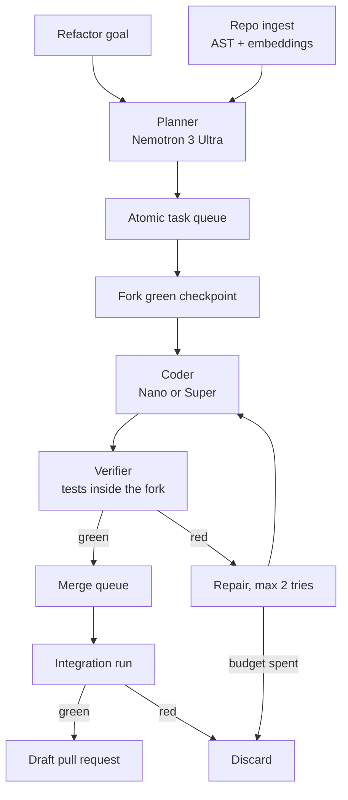
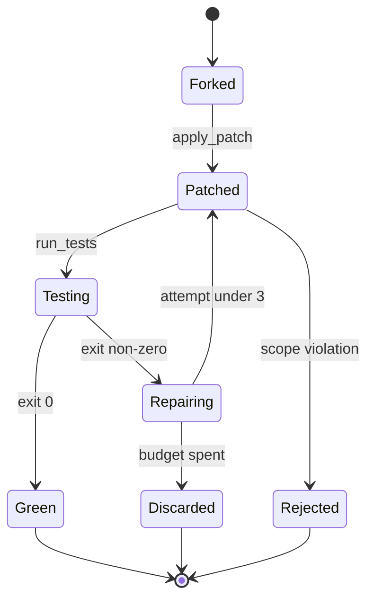

# Principal: PRD for an Autonomous Technical Debt Remediation Swarm

2026-09-18 · @Someone

*Nebius x NVIDIA Hackathon, Coding and Agentic Engineering track*

## Executive summary

Principal takes one repository-wide refactoring goal and returns a pull request that has already passed the repo's own test suite inside an isolated sandbox, or it returns nothing. There is no middle state where a human reviews a plausible-looking diff of unknown correctness.

The product bet is specific and testable. On Scale's SWE Atlas Refactoring leaderboard, [the best system, Claude Opus 4.7 with Claude Code, scores 48.57, and open models lag badly, usually by introducing regressions or failing to fully restructure the code](https://labs.scale.com/leaderboard/sweatlas-refactoring). The hackathon mandates an NVIDIA open model. So the thesis is that most of that gap is a scaffolding gap rather than a weights gap, and that verification-gated parallel search recovers a large share of it. That is a claim you can put a number on in three minutes of video, which is what wins judged hackathons.

The mechanism is the part nobody else will build. [Token Factory Sandboxes run OCI images in microVMs and let you checkpoint a state and fork from it](https://docs.tokenfactory.nebius.com/sandboxes/overview). Principal builds the repo once, checkpoints it green, then forks that checkpoint N ways to run N competing refactor candidates in parallel. Candidates that fail tests are discarded silently. Candidates that pass are ranked and merged. The agent never gets a second chance to convince anyone: the test suite decides.

| Field | Value |
| --- | --- |
| Product | Principal, an autonomous technical debt remediation swarm |
| Track | Coding and Agentic Engineering |
| Submission deadline | 30 October 2026, 10:00 PDT |
| Required by rules | Runtime call to Nebius Token Factory or Nebius AI Cloud, plus at least one NVIDIA open-source model |
| Core loop | Plan, fork sandbox, patch, test, discard or keep, open PR |
| Models | Nemotron 3 Nano, Super and Ultra, routed by task class |
| Headline metric | Verified refactor rate on a SWE Atlas Refactoring subset, against an unscaffolded Nemotron baseline |
| Hard guarantee | Fail closed. No red test, no PR |

One sentence for the judges: Principal is a coding agent that is allowed to be wrong in private and never in public.

## Problem and market context, with an honest audit of the numbers

The problem is real, the market is enormous, and four of the five numbers in the source brief are stated in a way a judge who knows the reports would mark wrong. Fix them before the video. A wrong headline stat on slide one costs more credibility than a weak demo costs points.

### What the sources actually say

| Claim in the brief | Real source | What it actually says | Safe on stage? |
| --- | --- | --- | --- |
| Technical debt costs the US $2.41T annually | [CISQ, Cost of Poor Software Quality in the US, 2022](https://www.it-cisq.org/the-cost-of-poor-quality-software-in-the-us-a-2022-report/) | $2.41T is the 2022 cost of poor software quality overall, [driven mostly by $1.44T of cybercrime losses plus $260B of failed projects](https://techdebtcalculator.com/benchmarks). Technical debt is not that $2.41T | No. Say poor software quality, never technical debt |
| Remediation cost is $1.52T | Same report | Accumulated US technical debt principal, [roughly equal to total US IT labour spend in 2022, and explicitly not added into the $2.41T](https://www.it-cisq.org/wp-content/uploads/sites/6/2022/11/CPSQ-Report-Nov-22-2.pdf) | Yes, as a 2022 figure, quoted alone |
| Over $3T in global productivity losses | Not found | No primary source located | Drop it |
| Developers spend 13.4 hours per week on technical debt | Stripe and Harris Poll, 2018 | [13.5 of a 41.1-hour week on technical debt, about 33%, and 17.3 hours on maintenance overall](https://techdebtcalculator.com/benchmarks) | Yes, but cite 2018 and say 13.5 |
| Legacy debt absorbs 21% to 40% of annual IT spend | McKinsey | [20% to 40% of the value of the entire technology estate](https://smicolon.com/blog/cost-of-poor-software-quality), which is an asset base, not an annual spend line | Rephrase. Do not quote it as spend |

### The argument that does not need inflated numbers

The strongest evidence for this product is not macroeconomic, it is benchmark evidence, and it is months old rather than four years old. [Frontier models that score above 80% on SWE-Bench Verified score under 50% on SWE Atlas Refactoring](https://labs.scale.com/leaderboard/sweatlas-refactoring). Issue resolution is close to solved. Behaviour-preserving restructuring across many files is not.

That gap exists because refactoring inverts the usual task shape. A bug fix is local, specified, and has a test that goes from red to green. A refactor is diffuse, under-specified, and starts with a green test suite that must stay green, so the agent gets no reward signal for progress and an enormous surface area for silent regression. [SWE Atlas Refactoring tasks need roughly 2x the lines changed and 1.7x the files edited of SWE-Bench Pro tasks](https://labs.scale.com/leaderboard/sweatlas-refactoring), across Go, TypeScript, Python, C, C++ and JavaScript.

So the honest pitch is this. The economically largest category of software maintenance work is also the category where coding agents are measurably worst, and the failure mode is regression rather than refusal. That is a verification problem, which is exactly what a sandbox-native swarm is for.

## Users and jobs to be done

Principal has one primary user and two people who unblock the purchase. Build for the first, design the artifacts for the other two.

| Persona | Job to be done | What they judge Principal on | Current workaround |
| --- | --- | --- | --- |
| Staff or principal engineer (primary) | Land a cross-cutting migration across 150 files without spending three weeks on mechanical edits | Does the PR read like something a competent engineer wrote, and does CI pass on the first push | Codemods, jscodeshift, sed plus manual fixups, or the migration never happens |
| Platform or infra lead (approver) | Retire a deprecated internal API so the platform team can delete the shim | How many consumer repos actually migrated, and how many rollbacks it caused | Deprecation notices, a wiki page, then chasing teams in Slack for six months |
| Engineering manager (budget) | Get maintenance load off the team without hiring | Hours of engineer time returned per month, and zero production incidents attributable to the tool | Accepting the debt and reprioritising |

The primary user is not looking for code suggestions. They already have those. They are looking for someone to do the boring 80% of a migration they have already decided on, and to prove it did not break anything. That framing matters for the UI: Principal's main output is not a chat transcript, it is a pull request plus a verification report.

### The jobs Principal does not do

It does not decide which debt is worth paying down. A human sets the goal. Principal is a very good staff engineer with no taste and infinite patience, not an architect. Pretending otherwise invites the obvious judge question about why anyone would let an agent choose what to rewrite in their monolith, and there is no good answer to that question in a hackathon demo.

## Competitive landscape

The brief positions Principal against Copilot. That is the wrong comparison and a judge will say so. Copilot has not been the relevant baseline for two years. The real competitors are autonomous agents that already open pull requests, and the differentiator has to be the verification architecture, not the autonomy.

| System | What it does | Where it stops |
| --- | --- | --- |
| Copilot, Cursor, and inline assistants | Human-driven edits, file or selection scoped | The human still drives the migration file by file |
| Devin and similar autonomous agents | Full task autonomy, opens PRs | General purpose, single long-lived workspace, weak behaviour-preservation guarantees on large refactors |
| Sweep, and issue-to-PR bots | Turns an issue into a PR | Issue-shaped work, not architecture-shaped work |
| Sourcegraph Batch Changes and OpenRewrite | Deterministic, repo-wide, reliable | Requires a human to write the codemod or recipe. Cannot handle changes needing semantic judgement |
| Renovate and Dependabot | Fully autonomous, fully trusted, runs in production today | Dependency bumps only, no structural change |

The interesting row is the last one. Renovate is the existence proof that engineers will merge fully automated PRs without reading them carefully, and the reason is not that the model is smart. It is that the change class is narrow, the verification is total, and the failure mode is a red build rather than a silent regression. Principal's strategy is to reproduce those three properties for a wider class of change, not to be more autonomous than Devin.

### The positioning line

OpenRewrite makes you write the recipe. Devin makes you trust the agent. Principal makes the test suite the arbiter, which is the only referee an engineering org already trusts.

## Vision, principles and non-goals

Vision: every deprecated API, every duplicated helper and every god class in a repository has a standing bot that can retire it, and the only human input is approval.

### Design principles

1. **The test suite is the only judge.** No LLM-as-a-judge in the accept path. Rubric scoring is for evaluation, never for gating a PR. If a change cannot be verified, it is not shipped.
2. **Fail closed, silently.** A candidate that fails is discarded without ceremony. Principal producing no PR is a correct outcome, not an error. The demo should show this happening at least once.
3. **Isolation by construction, not by instruction.** Agents cannot touch the main branch because they have no credential that reaches it, not because the prompt tells them not to.
4. **Small atomic patches, never one giant diff.** Each unit of work is one coherent change with its own verification. The PR is a bundle of verified units.
5. **Spend tokens on search, not on size.** Three Nano candidates verified in parallel beats one Ultra candidate taken on trust. This is the core cost argument and it maps directly onto the hackathon credit budget.
6. **Every claim in the UI is backed by an artifact.** A test log, a diff, a sandbox operation id. No summary that cannot be clicked through to evidence.

### Non-goals for the hackathon build

- No autonomous debt discovery. The user supplies the goal. Auto-detection of what to refactor is a roadmap item and a demo liability.
- No IDE plugin, no VS Code extension. The surface is a web dashboard plus a GitHub PR.
- No multi-repo or monorepo-scale ingestion. One repository, one goal, one PR.
- No fine-tuning. The submission stands or falls on scaffolding, and fine-tuning would muddy the claim that scaffolding is what closed the gap.
- No production write access to anything. Principal opens a PR and stops.
- No support for build systems beyond the two chosen in scope. Every extra language is a day of environment debugging that buys no points.

## Scope: what V1 actually is

V1 is one refactor class, on Python and TypeScript, against a small set of pinned real repositories, producing a real GitHub PR. Everything else is cut.

### The chosen refactor class

Interface evolution, defined as: change how a module exposes functionality, update the signatures, and propagate the change through every consumer. This is [one of the four SWE Atlas refactoring types, alongside decomposition, extraction and relocation](https://scale.com/blog/swe-atlas-complete).

It is chosen over the other three for four reasons that all point the same way:

- The blast radius is computable. Call sites are a static analysis output, not a judgement call, so the planner can be grounded rather than creative.
- It decomposes cleanly. One consumer file is one atomic task, which is what makes parallel sandbox forks worth building.
- It fails loudly. A missed call site is a type error or an import error, not a subtle behaviour change, so the verification loop actually catches the common failure.
- It is visually obvious in a three-minute video. A dependency graph lighting up across 40 files reads instantly. A decomposition does not.

Decomposition is the more impressive demo and the worse engineering bet. It needs taste, it resists atomic decomposition, and its failures are silent. Keep it on the roadmap slide.

### Scope table

| Dimension | In scope for V1 | Explicitly out |
| --- | --- | --- |
| Languages | Python, TypeScript | Go, C, C++, Java, JavaScript build variants |
| Refactor types | Interface evolution | Decomposition, extraction, relocation |
| Repo size | Up to about 2,000 files, single repo | Monorepos, multi-repo, submodules |
| Test frameworks | pytest, vitest or jest | Anything needing a database, browser or external service |
| Goal input | Natural language plus the target symbol or module | Autonomous debt discovery |
| Output | Draft GitHub PR plus a verification report | Auto-merge, deploy, release |
| Concurrency | Up to 8 parallel sandbox forks | Unbounded fanout |

### Definition of done for V1

One command, one goal string, one repository URL. Within 20 minutes Principal returns a draft PR touching 20 or more files, whose diff passes the repository's existing test suite from a clean checkout, along with a report showing how many candidates were generated, how many were discarded, and why.

## System architecture

Four layers, one rule: nothing moves from left to right without passing a test. The single most important structural decision is that the sandbox checkpoint, not the git branch, is the unit of state.

Read it as a funnel. Many candidates enter, few survive, and the survivors are the only thing a human ever sees.

### The four layers

| Layer | Owns | Key artifact it produces | Model tier |
| --- | --- | --- | --- |
| 1. Context and planning | Repository comprehension and decomposition | A code graph plus an ordered list of atomic tasks with declared blast radius | Ultra for the plan, Nano for per-file summaries |
| 2. Routing and execution | Assigning tasks to coder agents and managing concurrency | Unified diffs, one per atomic task | Nano by default, Super on escalation |
| 3. Tool and sandbox layer | Every side effect in the system | Sandbox operation ids, checkpoints, test logs | None, deterministic code only |
| 4. Verification and assembly | Deciding what is real | A verification report and a merged patch set | Nano for stack trace triage only |

### The checkpoint as the unit of state

This is the part worth explaining slowly in the video, because it is the one architectural idea that is hard to copy in a weekend.

Conventional agent loops keep one working directory and mutate it. Every action is destructive, every rollback is a git operation, and parallelism means either N clones of the repo or no parallelism at all. Sandboxes change that shape. [Token Factory Sandboxes let you fork from any useful checkpoint to try alternatives, compare outcomes, and continue from the best branch](https://docs.tokenfactory.nebius.com/sandboxes/overview).

Principal uses that directly:

1. Ingest the repo into a microVM from an OCI base image, install dependencies, run the full test suite once, confirm green.
2. Checkpoint. Call this C0, the green baseline. Dependency install never runs again for this job, which is where most of the wall-clock savings come from.
3. For each atomic task, fork C0 into an isolated child. The coder agent works only inside its fork and can see only the files in its declared blast radius.
4. Run the affected tests inside the fork. Green forks produce a diff and a new checkpoint. Red forks get at most two repair attempts, then die.
5. Apply surviving diffs in dependency order onto a fresh fork of C0, run the full suite once, and only then open the PR.

Step 5 is not optional. Patches that each pass in isolation can still conflict, which is the failure mode that kills naive parallel agent systems and the reason the integration run is a separate gate.

## Agent roster

Five agent roles, each with a narrow contract. Anything not on this list is deterministic Python, which is the right default: the fewer decisions a model makes, the fewer places the system can be wrong.

| Agent | Input | Output | Model | Failure behaviour |
| --- | --- | --- | --- | --- |
| Cartographer | Repo tree, file contents | Per-file summary and exported symbol list, written to the code graph | Nano | Skip file, mark as unsummarised, continue |
| Planner | Goal, code graph, blast radius set | Ordered list of atomic tasks with dependencies | Ultra | Abort job with a reason. Never a partial plan |
| Coder | One task, its file, its blast radius slice, the target interface spec | A unified diff for that file only | Nano, escalating to Super | Emit no diff. Task marked failed |
| Repairer | Failing diff, stack trace, test output | A revised diff | Super | Give up after 2 attempts, discard candidate |
| Reporter | Verification log, merged patch set | PR title, body, risk notes | Nano | Fall back to a templated body |

### Contracts worth stating precisely

**Coder is file-scoped and cannot widen its own scope.** It receives exactly one file to modify plus read-only context, and its diff is rejected by a deterministic check if it touches any other path. If the coder believes it needs a wider change, it returns a scope-escalation signal that goes back to the Planner rather than editing more files. This is the single guardrail that prevents one agent quietly rewriting the repo.

**Planner never sees raw repository bulk.** It sees the code graph, symbol signatures and call-site locations, not file bodies. This is counterintuitive given that [Nemotron 3 models carry a 1M-token context window](https://developer.nvidia.com/blog/inside-nvidia-nemotron-3-techniques-tools-and-data-that-make-it-efficient-and-accurate/), but a large window is a capacity, not a strategy. Feeding 800K tokens of unfiltered repo into a planner produces worse plans and costs 50x more than feeding a structured graph. Use the window for the hard cases where the graph is genuinely ambiguous.

**Repairer sees the stack trace, not the goal.** Narrowing its context to the concrete failure stops it from rationalising a broken change as goal-aligned, which is the standard failure mode of self-healing loops that pass the original prompt back in on every retry.

**No agent has access to git credentials.** The PR is opened by the orchestrator using a scoped token, after verification. Agents produce diffs. That is all they produce.

### One deliberate omission

There is no Critic or Reviewer agent. A reviewer LLM scoring a diff before the tests run is theatre: it adds latency, adds cost and adds a second opinion that carries no information the test suite does not already carry with certainty. If a reviewer is added later, it ranks among already-green candidates. It never gates.

## Context and retrieval layer

Retrieval here is 80% static analysis and 20% embeddings, which is the opposite of the usual code RAG. For interface evolution, the question is which files call this symbol, and that has an exact answer that no vector search should be asked to approximate.

### The code graph

Parse every file once with tree-sitter (Python and TypeScript grammars), and emit four relations into SQLite:

| Relation | Rows | Used for |
| --- | --- | --- |
| defines | symbol, file, line, signature | Locating the interface to change |
| imports | file, imported symbol, source module | Building the consumer set |
| calls | caller symbol, callee symbol, file, line | Exact call-site enumeration |
| tests | test file, symbols it exercises | Selecting which tests to run per fork |

The tests relation is the one most teams skip and it is what makes per-fork verification fast. Running the full suite in every fork is the difference between a 20-minute job and a two-hour job.

### Blast radius

Blast radius is the transitive closure over imports and calls from the target symbol, capped at depth 3, plus every test file that touches any member of that set. It is computed deterministically before any model is called, and it is what the Planner plans over. A file outside the blast radius cannot be assigned to a coder, which means a scope violation is a structural impossibility rather than a prompt instruction.

### Where embeddings still earn their place

Three jobs only:

- Finding the target when the goal is stated in prose rather than as a symbol name, for example a request to replace the old auth middleware.
- Finding semantically duplicated helpers that the call graph cannot connect, which is a roadmap feature rather than a V1 one.
- Retrieving convention examples, meaning the two or three files that best show how this repo already does the thing the coder is about to do. This measurably improves diff quality and costs almost nothing.

### Reuse from Scoopp

A large part of this layer already exists in Scoopp, which cuts roughly a day and a half off the build:

- AST-aware chunking already works for Python and needs a tree-sitter path added for TypeScript.
- The normalised float32 matrix with cosine as a single matmul plus argpartition is already the right retrieval implementation at this scale. No vector database is needed for 2,000 files.
- The SHA-256 fingerprint cache over file contents plus chunk parameters already handles incremental re-indexing.
- The eval harness measuring recall@5, precision@5 and MRR transfers directly to measuring blast-radius recall, which is the single most important retrieval metric here. Missing a call site is the primary silent failure mode of the entire product.

Two changes are needed. Swap Ollama embeddings for a Token Factory embedding model so the pipeline is genuinely running on Nebius, and replace the pickle cache with SQLite so the code graph and the embedding cache share one store.

## Model routing policy

Route on task class, not on difficulty estimates, because a router that guesses difficulty is another model that can be wrong. The rule is simple: Nano runs everything, Super handles retries, Ultra plans once per job.

| Task class | Model | Calls per job | Why this tier |
| --- | --- | --- | --- |
| Per-file summarisation | Nemotron 3 Nano | 50 to 2,000 | [31.6B total with about 3.6B active per token](https://huggingface.co/blog/nvidia/nemotron-3-nano-efficient-open-intelligent-models), so this is the cheapest way to touch every file |
| Goal decomposition and planning | Nemotron 3 Ultra | 1 to 3 | [550B total, 55B active, hybrid Mamba-Attention MoE built for orchestration and long-running agentic work](https://openrouter.ai/nvidia/nemotron-3-ultra-550b-a55b:free). One good plan is worth more than a hundred good patches |
| First-attempt patch generation | Nemotron 3 Nano | 20 to 200 | Mechanical, tightly specified, heavily constrained by the prompt. Verified afterwards, so a cheap wrong answer costs almost nothing |
| Repair after test failure | Nemotron 3 Super | 5 to 50 | [Latent MoE calls 4x as many expert specialists at the same inference cost, plus multi-token prediction](https://developer.nvidia.com/blog/introducing-nemotron-3-super-an-open-hybrid-mamba-transformer-moe-for-agentic-reasoning/). The failure already proved Nano was not enough |
| PR body and risk notes | Nemotron 3 Nano | 1 | Formatting, not reasoning |

### Escalation rules

1. Nano attempt fails tests once, retry with Nano at a different temperature. Cheap resampling beats escalation more often than intuition suggests.
2. Second failure escalates to Super with the stack trace attached.
3. Third failure discards the candidate. No Ultra escalation for patches, ever. If a single file needs the frontier model, the plan was wrong, and the right fix is to route that back to the Planner as a scope-escalation signal.

### Cost and latency budget

The whole cost argument is the verification-gated parallelism claim: three cheap candidates plus a test run beats one expensive candidate taken on trust. State it as a budget so a judge can check it.

| Budget line | Target for a 40-file job |
| --- | --- |
| Total wall clock | Under 20 minutes |
| Ultra calls | 3 or fewer |
| Sandbox forks | 40 to 120 |
| Full-suite runs | Exactly 2, the baseline and the integration run |
| Per-fork test scope | Only tests touching the changed file, from the tests relation |

### Two engineering constraints to design around now

**Structured output is not enforced.** [Ultra accepts tools and tool\_choice for function calling, but does not support response\_format, so JSON output is not guaranteed](https://openrouter.ai/nvidia/nemotron-3-ultra-550b-a55b:free). Do not build the plan parser on the assumption of clean JSON. Use tool calling for structure, validate with Pydantic, and keep one reprompt-on-parse-failure path. A demo that dies on a stray markdown fence is an avoidable loss.

**Context ceiling depends on serving precision.** [Ultra serves a 262K-token window at BF16 and reaches the full 1M only under NVFP4 on Blackwell hardware](https://miraflow.ai/blog/nemotron-3-ultra-explained-nvidia-hybrid-mamba-moe-2026). Verify the actual served limit on Token Factory before designing any prompt that assumes a million tokens. The architecture above does not need it, which is deliberate.

## MCP tool surface

The tool list is the security model. An agent can do exactly what its tools allow and nothing else, so the design goal is the smallest surface that still completes the job. Nine tools, split across two MCP servers.

### Server 1: code-graph (read only)

| Tool | Arguments | Returns |
| --- | --- | --- |
| find\_symbol | name, kind | Definition site, signature, file, line |
| get\_callers | symbol, depth | Call sites with file and line |
| get\_blast\_radius | symbol, max\_depth | File set plus the test files that cover it |
| read\_slice | file, start\_line, end\_line | Source text, capped at 400 lines per call |
| find\_convention\_examples | description, k | Up to k files showing existing repo patterns |

read\_slice is capped deliberately. An uncapped file reader turns into an agent that pastes the repository into its own context and reasons badly at high cost.

### Server 2: sandbox (the only writes in the system)

| Tool | Arguments | Returns | Who may call it |
| --- | --- | --- | --- |
| fork\_checkpoint | checkpoint\_id | New sandbox id | Orchestrator only |
| apply\_patch | sandbox\_id, unified\_diff | Applied, or a rejection reason | Coder, inside its own fork |
| run\_tests | sandbox\_id, test\_paths | Exit code, stdout, stderr, duration | Coder and Verifier |
| checkpoint | sandbox\_id, label | Checkpoint id | Orchestrator only |

### Permission boundaries that are enforced in code, not in prompts

- apply\_patch rejects any diff touching a path outside the calling task's declared blast radius. The rejection is deterministic and happens before the patch is applied.
- apply\_patch rejects any diff that modifies a test file. An agent that can edit the tests can pass any test, and this is the single highest-value guardrail in the entire system.
- A coder agent holds a sandbox id for its own fork only. There is no tool that lists other sandboxes.
- No network tool, no shell tool, no package installation tool. Dependencies are installed once during baseline setup by the orchestrator.
- No GitHub tool of any kind. The orchestrator opens the PR after verification, using a token no agent ever sees.

### Why MCP rather than plain function calling

Be honest about this in the write-up, because a judge may ask. MCP buys three concrete things here: the same tool server backs the agents and the human-facing debugging CLI, so there is one implementation of the permission checks. Tool definitions are introspectable, so the dashboard can render what each agent was allowed to do at each step. And the sandbox server is reusable by any other MCP client afterwards, which is what makes this portfolio work rather than demo work. MCP does not make the agents smarter and the write-up should not claim it does.

The practical head start: the FastMCP server pattern from MemSync, with a SQLite-backed store, transfers almost directly to the code-graph server.

## Verification and the self-healing loop

Verification is the product. Everything upstream is a candidate generator, and candidate generators are commodity. This section is what a technical judge will probe hardest.

### The four gates

| Gate | Check | Cost | Catches |
| --- | --- | --- | --- |
| 1. Scope | Diff touches only declared blast-radius paths, no test files | Milliseconds | Agents widening their own mandate |
| 2. Syntax | File parses after patch, via tree-sitter | Under a second | Malformed diffs, truncated generations |
| 3. Local tests | Tests covering the changed file, from the tests relation | Seconds | The common regression |
| 4. Integration | Full suite on all merged patches, on a fresh fork of C0 | Minutes, once | Patches that conflict only in combination |

Gates are ordered by cost, cheapest first. Most bad candidates die at gate 1 or 2 for effectively zero tokens, which is what makes generous parallelism affordable.

### Behaviour preservation beyond test passing

Green tests are necessary and not sufficient, and saying so out loud is what separates this from every other agent demo. Three cheap additional checks, all deterministic:

- **Public API delta.** Compare the exported symbol set before and after. Any removal not named in the plan fails the candidate. This catches the agent that makes tests pass by deleting the thing under test.
- **Coverage floor.** Line coverage on touched files must not drop. A drop means code became unreachable, which usually means something was quietly removed.
- **Test count invariant.** The number of collected tests must be identical before and after. A patch that reduces collected tests is a patch that disabled tests, no matter what the exit code says.

These three take an afternoon to build and they are the answer to the question a good judge will ask, which is how you know the agent did not cheat.

### Retry policy

Retries are bounded at 3 attempts per task, 2 stack-trace repairs plus the original. Each retry gets the failure output and nothing else, no accumulated conversation history. Unbounded retry loops burn budget, produce increasingly incoherent diffs as context fills with failures, and are the most common way an agentic demo runs out of credits mid-presentation.

### Fail-closed rules

The system produces no pull request when any of these hold: the baseline suite is not green before work starts, the integration run fails, more than 30% of planned tasks were discarded, or any behaviour-preservation check fails. In each case Principal reports what it attempted and why it stopped. That report is a legitimate demo outcome and rehearsing it is worth more than hoping it never happens.

## Safety, security and human in the loop

An agent with repository write access is a supply chain attack surface. Most hackathon projects wave at this. Treating it seriously is cheap here because the architecture already gives it for free, and it is a strong differentiator in a track full of agents that run shell commands.

| Threat | Mechanism | Mitigation |
| --- | --- | --- |
| Prompt injection from repo content | A comment or docstring in the codebase instructs the agent | Repo content is data, never instruction. Coder tools accept no path or command from file content, and the blast radius is fixed before any model reads anything |
| Malicious dependency injection | Agent adds a package to satisfy a refactor | No package installation tool exists. A diff touching a manifest or lockfile is rejected at gate 1 |
| Test tampering | Agent edits tests to go green | apply\_patch rejects any diff touching a test path. Enforced in code, and the test count invariant catches whatever slips past |
| Secret exfiltration | Agent reads .env and puts it in a diff or a log | Secrets are stripped at ingest. The sandbox has no outbound network. Diffs are scanned for high-entropy strings before the PR is opened |
| Silent regression reaching production | Green tests, broken behaviour | Behaviour-preservation checks plus mandatory human approval. Principal opens draft PRs only |
| Runaway cost | Retry loop consumes the credit budget | Hard caps on forks per job, attempts per task and total tokens per job. The job aborts and reports rather than continuing |

### The human in the loop, specifically

Approval sits at exactly one place: the draft pull request. Not mid-plan, not per-patch. Mid-run approval prompts are how autonomous systems become slower than doing it by hand, and they make the demo unwatchable.

What the human gets at that gate:

- The diff, grouped by atomic task rather than by file, so the change reads as a sequence of decisions.
- The plan that produced it, including tasks that were planned and then discarded.
- Test evidence per task: which tests ran, which passed, how long they took, and the sandbox operation id.
- A risk list: files with no test coverage that were modified, and any task that needed a repair attempt.

That last item matters more than it looks. A refactored file with zero test coverage is the one place the whole verification argument is silent, and surfacing it honestly is more persuasive to a technical audience than hiding it.

### Scope of trust

Principal is trusted to write code, not to decide what to write or whether to ship it. Everything it produces is reviewable, reversible and gated. That sentence belongs in the video.

## Evaluation plan

One headline number decides whether this submission is memorable: how much of the open-versus-frontier refactoring gap the scaffold recovers. Everything else is supporting evidence.

### The benchmark

Use [SWE Atlas Refactoring](https://labs.scale.com/leaderboard/sweatlas-refactoring), the third benchmark in Scale's SWE Atlas suite, restricted to a subset that matches V1 scope. It is the right choice because it tests precisely what Principal claims: [tasks drawn from 10 production repositories across 6 languages, graded on passing existing tests, avoiding regressions, and rubric criteria covering maintainability, documentation, artifact cleanup and negative-regression checks](https://labs.scale.com/leaderboard/sweatlas-refactoring).

Note the name. The brief says SWE-Bench ProMax, which does not exist. The two real benchmarks are SWE-Bench Pro and SWE Atlas. Getting this wrong in the submission is a small unforced error with a large credibility cost.

**Subset definition:** Python and TypeScript tasks only, interface-evolution type only. Expect roughly 15 to 25 usable tasks out of [the suite's 284](https://scale.com/blog/swe-atlas-complete). Publish the exact task ids in the repo so the result is reproducible.

### The comparison that matters

| Arm | Setup | What it isolates |
| --- | --- | --- |
| A. Baseline | Nemotron 3 Super, single agent, full repo in context, one attempt, no sandbox | What the open model does unaided |
| B. Sandbox, no swarm | Same model, one sandbox, tests available, retry on failure | Value of verification alone |
| C. Principal | Full swarm, blast radius, parallel forks, routing | Value of the full architecture |
| D. Reference | Published frontier scores on the same tasks | Honest distance to the state of the art |

Arm B is the one most teams skip and it is the one that makes the result credible. Without it, a judge cannot tell whether the multi-agent swarm did anything, or whether simply letting the model run tests was the whole improvement. If B captures most of the gain, say so. An honest negative result on the swarm component is far better received than an unfalsifiable claim, and it is the kind of thing that gets remembered.

### Metrics

| Metric | Definition | Target for arm C |
| --- | --- | --- |
| Verified refactor rate | Tasks where the final patch passes the full suite and all behaviour checks | Beat arm A by 2x or more |
| Regression rate | Tasks where a PR was opened and a held-out test failed | 0% by construction. If not 0, the fail-closed logic has a bug |
| Call-site recall | Fraction of true call sites in the blast radius set | Above 0.98. This is the silent-failure metric |
| Candidates per accepted patch | Forks generated divided by patches merged | Report honestly. 3 to 5 is the expected cost of search |
| Wall clock per task | Baseline setup excluded | Under 20 minutes |
| Cost per verified task | Token Factory spend divided by verified refactors | The number that makes the cheap-parallel-search argument concrete |

### Guarding against the obvious criticism

Run arm A and arm C on the same task list, the same day, with the same model versions, and log every model call. Publish the trace files. A hackathon result with published traces is worth several times one without, and it costs nothing beyond remembering to write the logs to disk from day one.

## Success metrics

Two scoreboards run at once. The product scoreboard is what makes this worth building. The hackathon scoreboard is what wins in October. They overlap but they are not the same, and optimising only the first is how good projects lose.

### Hackathon scoreboard

| Requirement | Status target before submission |
| --- | --- |
| Runtime call to Token Factory or Nebius AI Cloud | Core dependency, not an adapter bolted on |
| At least one NVIDIA open-source model | Three Nemotron 3 tiers, each with a stated reason |
| Public repo, open-source licence, setup instructions | README that runs from a clean clone, one command |
| Working demo or hosted test build | Hosted dashboard on Nebius Serverless Endpoints |
| Demo video under three minutes, in English | Rehearsed, on a pre-recorded successful run |
| Track identification | Coding and Agentic Engineering, stated explicitly |
| Feedback on Nebius and NVIDIA tooling | Written during the build, not remembered at the end |

Two things in that list are cheap and routinely fluffed. The README that actually runs from a clean clone is worth real points and takes an hour. The tooling feedback is explicitly requested by the organisers, which means writing a substantive one is free differentiation: log every friction point as it happens, especially around sandbox limits and structured output.

### Judging criteria and where the points are

| Criterion | How Principal scores | The risk |
| --- | --- | --- |
| Impact | Largest measured weakness in coding agents, quantified | Losing credibility on an inflated macro stat |
| Technical execution | Checkpoint-fork parallelism is genuinely hard and genuinely Nebius-native | Demo fails live |
| Use of the stack | Sandboxes plus three-tier routing is the track brief almost verbatim | Looking like a wrapper with Nemotron swapped in |
| Originality | Verification-gated search rather than a bigger model | Judges have seen many PR-opening agents |
| Completeness | Benchmark numbers, published traces, working hosted demo | Running out of time and submitting a plan |

### Product scoreboard, if this outlives the hackathon

| Metric | Why it is the right one |
| --- | --- |
| PR merge rate without human edits | The only real measure of whether the output is trusted |
| Rollbacks attributable to a Principal PR | Must stay at zero. One incident ends adoption |
| Engineer hours returned per merged PR | Estimated from files touched and historical migration velocity |
| Migrations completed that would otherwise not have happened | The honest value story, since most of this work is not deferred, it is abandoned |

## Tech stack and infrastructure

| Component | Choice | Reasoning |
| --- | --- | --- |
| Inference | Nebius Token Factory, OpenAI-compatible at [api.tokenfactory.nebius.com/v1](https://strandsagents.com/docs/community/model-providers/nebius-token-factory/) | Required by the rules, and the OpenAI wire format means any client library works |
| Code execution | Token Factory Sandboxes | [OCI images in microVMs with checkpoint and fork](https://docs.tokenfactory.nebius.com/sandboxes/overview). This is the architecture, not a detail |
| Orchestrator | FastAPI plus asyncio | Already familiar from MemSync. Async is a better fit than Celery here, see below |
| Job and graph store | SQLite, with Postgres as a later swap | One file, no infrastructure, and the code graph is naturally relational |
| Parsing | tree-sitter, Python and TypeScript grammars | One API for both languages, error-tolerant on files that do not fully parse |
| Dashboard | React plus server-sent events | The swarm's progress is the demo, so streaming is the core UI requirement |
| Hosting | Nebius Serverless Endpoints | [Encouraged by the organisers, not required](https://www.startupnetworks.co.uk/links/link/30717-nebius-x-nvidia-global-ai-hackathon/), and it satisfies the hosted-demo requirement |
| Traces | JSONL to disk, one file per job | Publishing traces is most of the credibility, and it costs one function |

### Disagreeing with the brief on Celery and Redis

The brief specifies FastAPI plus Celery plus Redis. Drop Celery and Redis for V1. The workload is IO-bound waiting on HTTP: sandbox operations are [async with polling and cancellation support](https://docs.tokenfactory.nebius.com/sandboxes/overview), and inference is an HTTP call. asyncio with a bounded semaphore handles 8 concurrent forks without breaking a sweat. Celery adds a broker, a worker process, a serialisation boundary and a whole category of debugging that produces zero visible demo value. Add it when there are multiple tenants and jobs must survive a restart, which is a real reason and not a V1 reason.

### The one thing to verify in week one

Sandbox access is per-project and can be closed. A public demo repo [reported a 403 on the sandbox project probe with no execution permissions](https://github.com/jessecalvin08/rulebranch), and another [verified live sandbox execution working on 11 September 2026 with the same API key used for both sandboxes and inference plus a Project header](https://github.com/kreuzhofer/nebius-token-factory-sandbox-demos). Prove a sandbox smoke test end to end before writing a single agent. If sandbox access turns out to be unavailable, the entire architecture needs rethinking, and that is a week-one discovery rather than a week-six one.

### Local development

Orchestrator development runs fine on the RTX A5000 Windows machine, because nothing heavy runs locally. All execution is remote microVMs and all inference is remote HTTP, which sidesteps the no-WSL constraint entirely. That is a real argument for this architecture over a local Docker sandbox, and it is worth noting in the tooling feedback.

## Build plan

Six weeks remain to the 30 October deadline. That is not the constraint. The constraint is final-year coursework, NPTEL assignments and everything else competing for the same evenings, so this plan is built around a working system existing at the end of week three, with everything after that being improvement rather than completion.

| Week | Milestone | Done means |
| --- | --- | --- |
| 1 | Sandbox spike and code graph | A Python script imports an OCI image, runs pytest on a real repo inside a sandbox, checkpoints, forks, and confirms the fork is independent. Separately, tree-sitter emits the four relations into SQLite |
| 2 | Single-agent vertical slice | One coder agent changes one file in a fork, tests run, a diff comes back. Arm B of the evaluation exists |
| 3 | The swarm | Planner produces atomic tasks, 8 forks run in parallel, patches merge, integration gate runs, a real draft PR opens on GitHub |
| 4 | Verification hardening and benchmark | The four gates, the three behaviour-preservation checks, arms A and C run on the task subset, numbers exist |
| 5 | Dashboard and hosting | Streaming UI, deployed on Serverless Endpoints, README runs from a clean clone |
| 6 | Video, write-up, buffer | Recorded demo, tooling feedback written, submission filed with days to spare |

### Cut lines, in the order things get cut

1. TypeScript support. Python only is a complete demo. Say multi-language is architectural and show the tree-sitter abstraction.
2. The dashboard's prettier half. A streaming terminal UI with good output is acceptable and reads as authentic.
3. Arms B and D of the evaluation. Keep A versus C at absolute minimum, because without a baseline there is no claim.
4. Parallelism beyond 3 forks. The architecture is the point, not the fanout number.

### What never gets cut

The integration gate, the scope check, the test-file rejection, and having real benchmark numbers. Those four are the submission. A beautiful dashboard over an unverified agent is the exact project this one is supposed to beat.

### The week-one decision point

If the sandbox spike is not working by end of week one, stop and reassess rather than pushing on. The fallback is a local Docker sandbox with Token Factory used for inference only, which still satisfies the rules but loses the strongest differentiator. Better to know in week one and reshape the pitch than to discover it in week five.

## Demo video script

The video is capped at three minutes. Budget every second, and open on the product rather than the problem, because the macro statistics are the weakest part of the story and the first fifteen seconds decide whether a judge watches the rest.

| Time | On screen | Said |
| --- | --- | --- |
| 0:00 to 0:15 | A real repo, the goal typed into one input | This repository has a deprecated interface used in 43 files. Nobody has migrated it in two years. Watch |
| 0:15 to 0:35 | Dependency graph builds, blast radius lights up 43 files | Principal parses the repo, finds every call site exactly, and plans 43 atomic changes. That is static analysis, not a guess |
| 0:35 to 1:05 | 8 sandbox tiles running in parallel, some going green, two going red | Each change runs in its own forked microVM on Nebius. Nemotron 3 Nano writes the patch, the repo's own tests judge it. Two just failed and were discarded. You will never see those |
| 1:05 to 1:25 | A red tile retrying, escalating, going green | This one failed twice, so it escalated to Nemotron 3 Super with the stack trace. Now it passes |
| 1:25 to 1:45 | Integration run on a fresh fork, full suite green | Passing separately is not enough. All 41 surviving patches are applied together and the full suite runs once more |
| 1:45 to 2:05 | The draft PR on GitHub, grouped by task, with test evidence | A draft pull request. Every file, every test, every sandbox operation id, and the two changes it could not make |
| 2:05 to 2:35 | The benchmark chart, arms A and C side by side | On SWE Atlas Refactoring, the open model alone scores X. The same model inside Principal scores Y. The scaffold did that, not a bigger model |
| 2:35 to 2:55 | Architecture diagram, one slide | Fork a green checkpoint, patch, test, discard or keep. Failure is free because it is private |

### Rules for recording it

- Record a real run and cut it down. Never simulate. Judges can tell, and one fake frame invalidates everything else.
- Show a failure. The two discarded candidates are the most persuasive thirty seconds in the video, because every judge has watched an agent confidently produce a broken diff.
- Say Nemotron and Token Factory by name, out loud, tied to a specific job. Generic gratitude to the sponsor stack reads as a wrapper.
- Put the benchmark number on screen as text, not just in the voiceover.
- No slide of trillion-dollar statistics. If the macro number appears at all, one line of on-screen text with the source and year is enough.

### The backup plan

Pre-record one complete successful run on the day everything works, and keep the trace file and the resulting PR. If the live system breaks in the final week, the video is already made from a real run, and the repo still contains reproducible traces. This costs twenty minutes in week four and removes the single largest submission risk.

## Risks and mitigations

Ranked by probability of killing the submission, not by severity in the abstract. The top three are all schedule risks, which is usually true and usually ignored.

| Risk | Likelihood | Impact | Mitigation |
| --- | --- | --- | --- |
| Scope creep. Four refactor types, six languages, a beautiful dashboard, nothing finished | High | Fatal | The cut list is written down and ordered. Week three is the hard checkpoint: a real PR exists or scope is cut that day |
| Test environment setup eats the schedule | High | Severe | Pin 3 target repos in week one and verify each builds and tests green inside a sandbox before committing to it. Repos with heavy native dependencies are rejected on sight |
| Sandbox access is restricted or slow | Medium | Fatal to the architecture | Week-one spike, before any agent code. Local Docker fallback documented |
| The swarm adds nothing over arm B | Medium | Reputational, not fatal | Report it honestly. An honest negative result on one component with a strong verification story is still a strong submission |
| Credit budget exhausted mid-benchmark | Medium | Severe | Hard token caps per job, Nano-first routing, and the benchmark run scheduled before the demo recording, not after |
| Nemotron JSON parse failures in the plan path | Medium | Annoying | [response\_format is not supported on Ultra](https://openrouter.ai/nvidia/nemotron-3-ultra-550b-a55b:free), so use tool calling, validate with Pydantic, and keep one reprompt retry |
| Patches conflict at integration | Medium | Recoverable | Integration gate exists precisely for this. Serialise tasks that share a file rather than parallelising them |
| Agent games the tests | Low, given the guardrails | Fatal to credibility | Test-file writes rejected in code, test count invariant, public API delta check |
| Live demo fails during judging | Low | Severe | Pre-recorded run from week four, kept regardless |

### The failure mode worth naming out loud

The most likely bad outcome is not a crash. It is a system that works on one hand-picked repository and cannot be shown working anywhere else, because the repo selection quietly did all the work. The defence is to pin three repositories in week one, from different owners, and to run the demo flow on all three in week four. If it only works on one, that is important information and it belongs in the write-up rather than hidden behind a single rehearsed path.

## Open questions

Eight things this PRD assumes. The first four are blocking and should be answered in week one, before any agent code is written.

- [ ] **Is Sandbox access enabled on the account?** Blocking. One demo repo hit a 403 on the project probe. Run a smoke test on day one.
- [ ] **Does fork from checkpoint work the way the docs describe, and how fast?** Blocking, because the entire parallelism argument rests on fork being cheaper than re-provisioning. Measure fork latency directly.
- [ ] **Are Nemotron 3 Nano, Super and Ultra all actually served on Token Factory right now, and at what context limits?** Blocking. Query the model-list API rather than pinning a model id from a blog post.
- [ ] **Does function calling work reliably on the served Nemotron endpoints?** Blocking for the MCP design. Function-calling support varies by model and needs live verification.
- [ ] Which three target repositories? Needs Python, pytest, a green suite, under 2,000 files, no native build dependencies, and a genuinely deprecated interface with many call sites.
- [ ] How many SWE Atlas Refactoring tasks actually match the V1 subset? If the answer is under 10, the benchmark claim needs a wider subset or a hand-built task set with published construction methodology.
- [ ] What is the realistic credit budget, and what does one full benchmark run cost? Measure on a single task in week two and extrapolate before committing to the arm structure.
- [ ] Solo or team? Everything above is scoped for one person working evenings. A second person changes the cut list, mostly by making TypeScript and the dashboard survivable.

### Assumptions stated so they can be falsified

1. Verification-gated parallel search recovers a large share of the open-versus-frontier refactoring gap. This is the whole thesis, and arm B of the evaluation is designed to falsify it.
2. Interface evolution decomposes into per-file atomic tasks cleanly enough that most tasks are independent. If most tasks turn out to be coupled, parallelism collapses and the architecture loses its main advantage.
3. Deterministic blast radius beats retrieval-based context selection for this task class. Call-site recall measures it.
4. Repository test suites are a good enough behaviour oracle. They are not, universally, which is why the three extra behaviour checks exist and why the PR is a draft.

## Roadmap and why this is worth six weeks

The roadmap matters less than what the build leaves behind. Ranked by what it actually buys:

| After V1 | What it adds | Difficulty |
| --- | --- | --- |
| Decomposition and extraction refactor types | Covers the other two SWE Atlas categories | High. Needs judgement, resists atomic splitting |
| Autonomous debt detection | Principal proposes work instead of waiting for a goal | Medium technically, hard socially. Requires trust that V1 has to earn first |
| Continuous mode | Runs on every merge to main, opens PRs when debt crosses a threshold | Medium. This is the Renovate model and it is where the real product is |
| Go and Java | Where enterprise debt actually lives | Medium. Mostly build-system work, which is tedious rather than interesting |
| Learned routing | Predict which tasks need Super from features of the task | Low value. The current rule is nearly free and nearly as good |

### What this is worth outside the hackathon

This is the strongest project on the list for interview conversation, and specifically better than another RAG or predictor build, for four reasons.

It has a falsifiable claim with a number attached. Most projects describe what was built. This one answers a research question, which is a fundamentally different conversation and the one that plays well against a security-shaped resume.

It demonstrates distributed systems thinking, not just LLM plumbing. Checkpoint forking, dependency-ordered patch application, bounded concurrency, and a merge conflict gate are systems problems. Anyone can call an inference API. Very few candidates can explain why patches that each pass in isolation can still fail together.

The security framing is genuinely yours. The tool surface as security boundary, the test-tampering guardrail, the prompt-injection-from-repo-content threat model: that is the same instinct that found an IDOR in a production system, applied to agent design. Agent security is an area where almost nobody has hands-on opinions yet.

And it composes with existing work rather than starting cold. Scoopp becomes the retrieval layer, the MemSync MCP server pattern becomes the tool layer, and both stop being standalone side projects and start being components of something larger. That is a better story than three unrelated repos.

### Sources

- [Nebius x NVIDIA Global AI Hackathon, tracks and requirements](https://www.startupnetworks.co.uk/links/link/30717-nebius-x-nvidia-global-ai-hackathon/)
- [Nebius Token Factory Sandboxes overview](https://docs.tokenfactory.nebius.com/sandboxes/overview)
- [SWE Atlas Refactoring leaderboard, Scale](https://labs.scale.com/leaderboard/sweatlas-refactoring)
- [SWE Atlas suite overview, Scale](https://scale.com/blog/swe-atlas-complete)
- [Nemotron 3 Super, NVIDIA technical blog](https://developer.nvidia.com/blog/introducing-nemotron-3-super-an-open-hybrid-mamba-transformer-moe-for-agentic-reasoning/)
- [Nemotron 3 family technical overview, NVIDIA](https://developer.nvidia.com/blog/inside-nvidia-nemotron-3-techniques-tools-and-data-that-make-it-efficient-and-accurate/)
- [Nemotron 3 Nano specifications, Hugging Face](https://huggingface.co/blog/nvidia/nemotron-3-nano-efficient-open-intelligent-models)
- [Nemotron 3 Ultra capabilities and limits, OpenRouter](https://openrouter.ai/nvidia/nemotron-3-ultra-550b-a55b:free)
- [Nemotron 3 Ultra context window and precision, Miraflow](https://miraflow.ai/blog/nemotron-3-ultra-explained-nvidia-hybrid-mamba-moe-2026)
- [CISQ, Cost of Poor Software Quality in the US, 2022](https://www.it-cisq.org/the-cost-of-poor-quality-software-in-the-us-a-2022-report/)
- [Technical debt benchmark sourcing and caveats](https://techdebtcalculator.com/benchmarks)
- [Token Factory Sandboxes live verification notes](https://github.com/kreuzhofer/nebius-token-factory-sandbox-demos)
