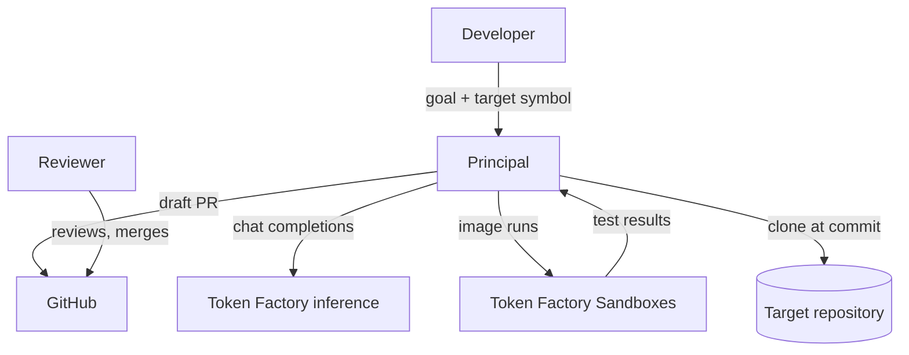
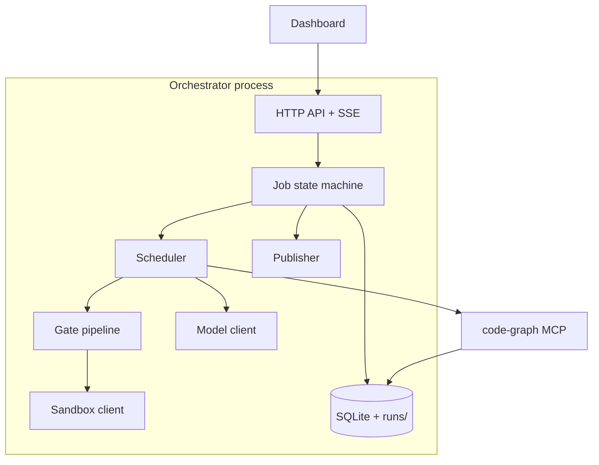
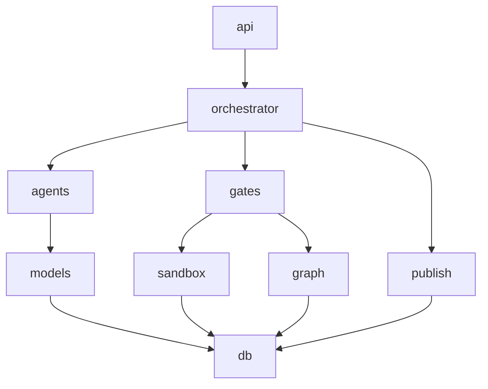
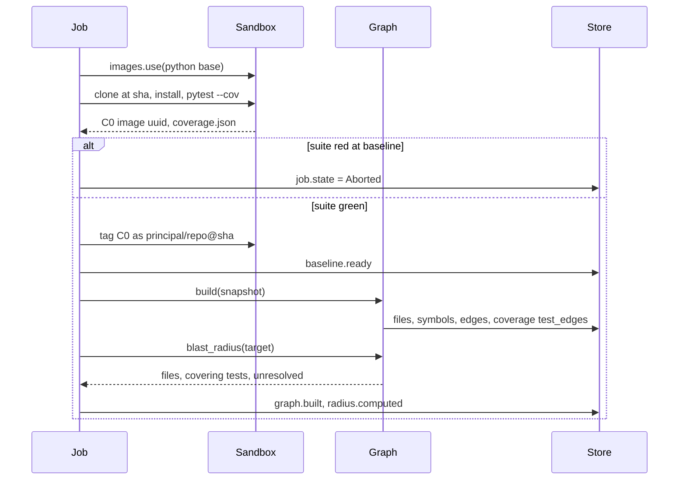
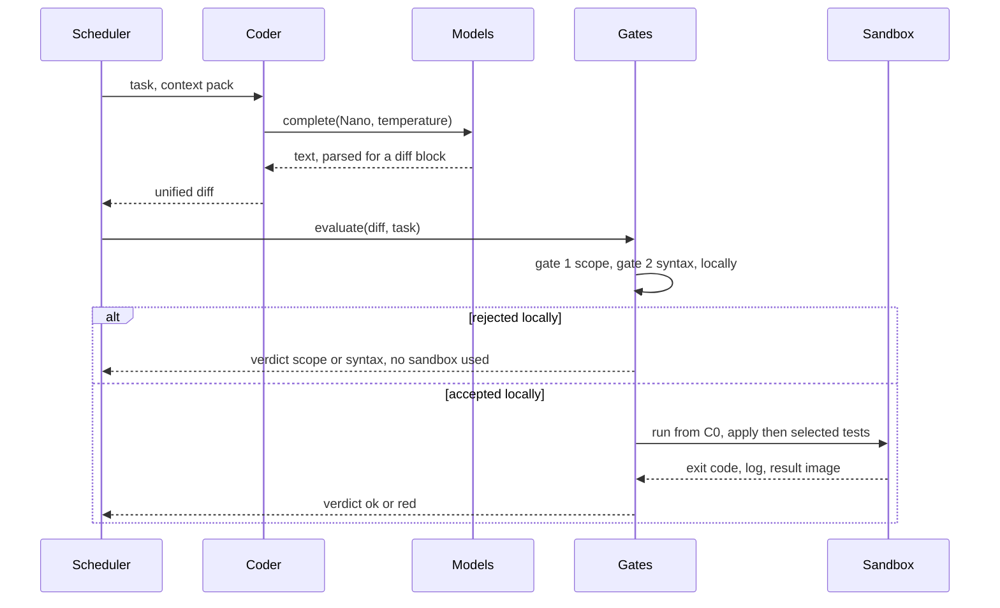
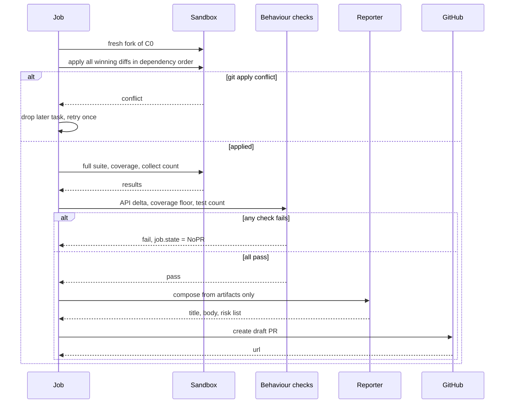
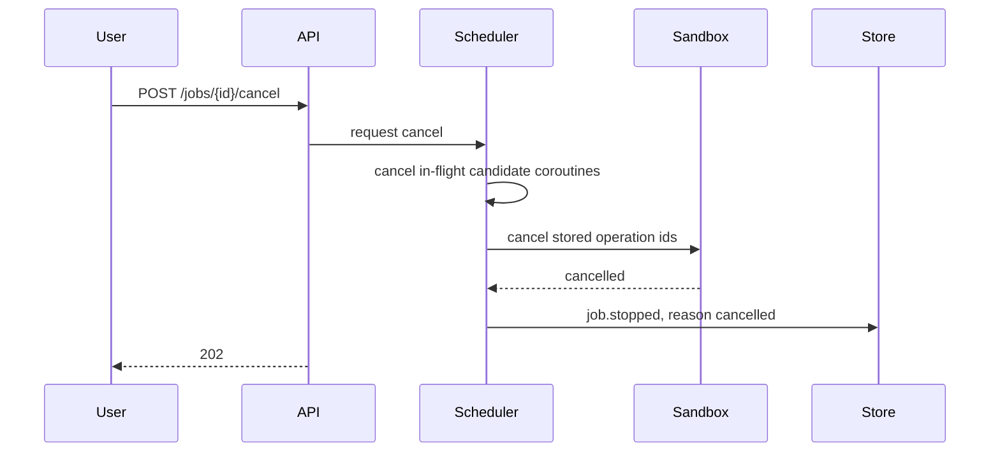
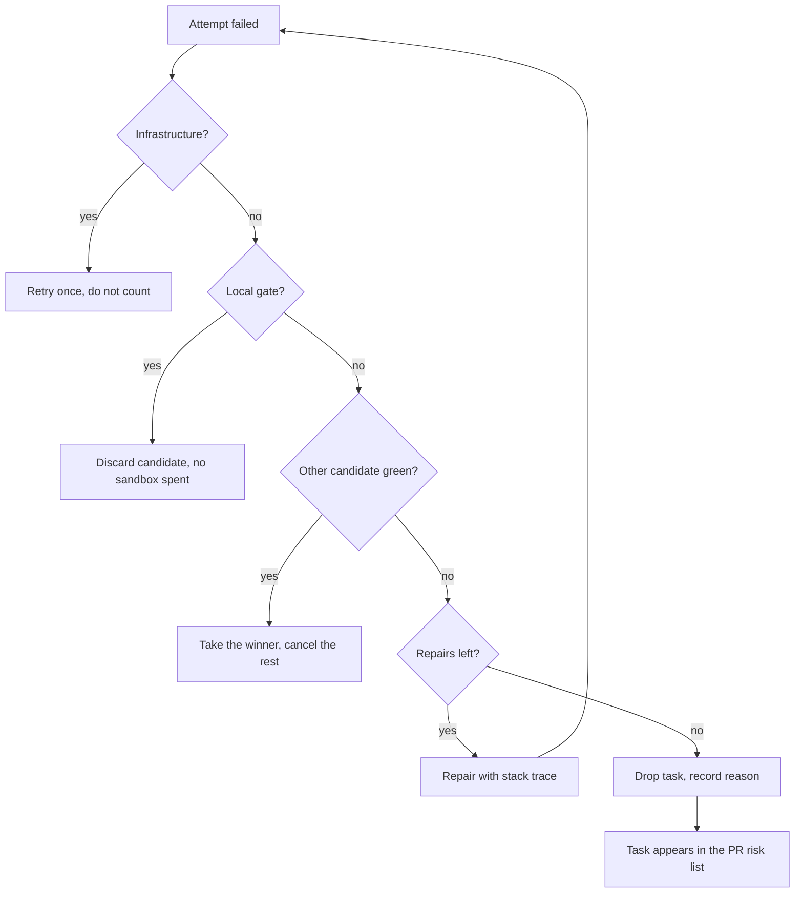
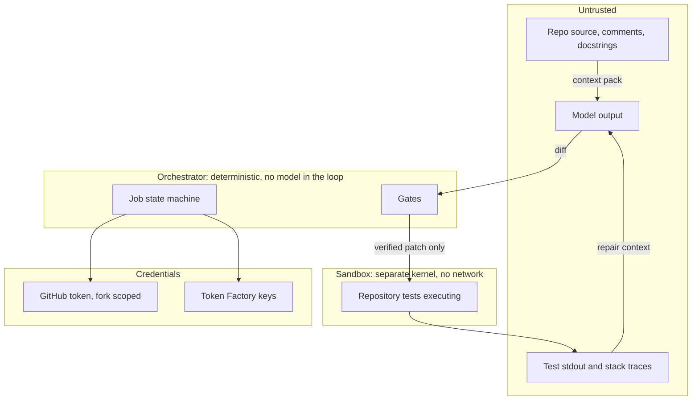
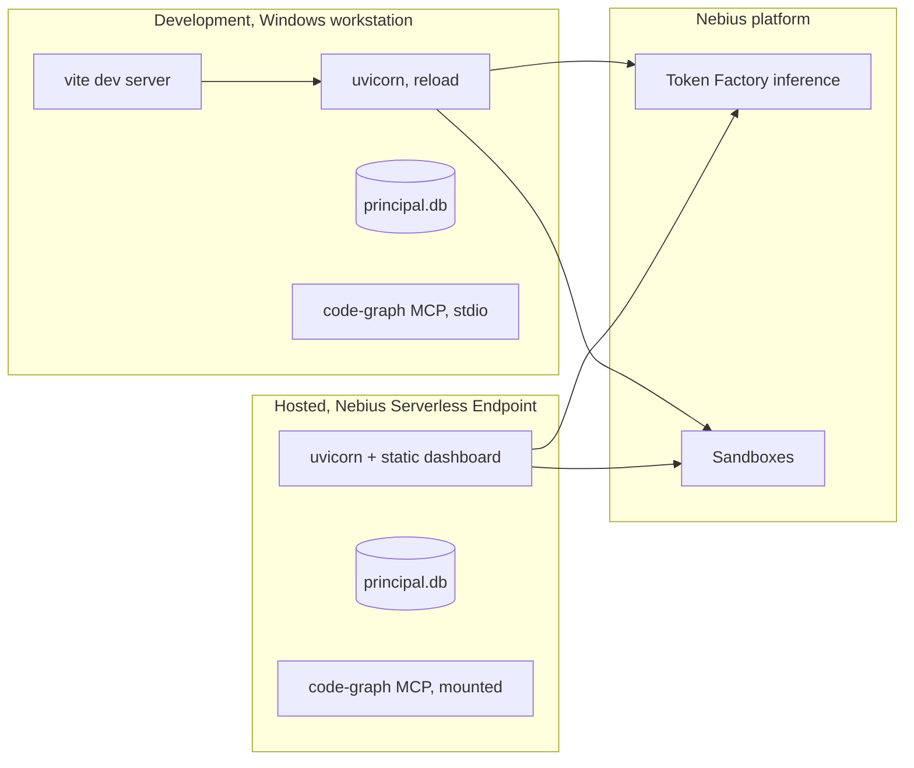

# Principal: technical specification

2026-09-18 · @Someone

Implementation-level reference for Principal. The PRD decides what to build and why, the design document decides the structure and the key trade-offs, and this specifies the parts you need open on a second monitor while writing code: component contracts, algorithms, diagrams, file layout, configuration, error codes, budgets and the test plan.

## Scope and system overview

### The document set

| Document | Answers | Read it when |
| --- | --- | --- |
| PRD | What Principal is, who it is for, why it is worth six weeks | Deciding scope or writing the pitch |
| Design document | How the system is structured and which trade-offs were made | Deciding where a change belongs |
| This specification | What each piece does, in what order, with what inputs and limits | Writing code |

This document assumes both of the others and does not restate their arguments. Where it contradicts them, it wins, because it was written after the platform research and against the real APIs.

Out of scope here: the pitch, the benchmark arm design, the demo script, and anything about why the product is worth building. Those live in the PRD and have not changed.

### System context



Principal never merges anything. The reviewer is inside the boundary of the system as designed, not an optional extra, and every guarantee below assumes a human approves before code lands.

### Containers



Eight components in one process, one child process for MCP, one static frontend. That is the entire system. Resisting the urge to split it into services is a deliberate choice: a single process with a single SQLite file can be reasoned about at 2am in week five, and nothing in the workload needs more.

### Anchor numbers

Every budget, timeout and concurrency setting in this document derives from these. They are measured platform facts, not estimates, and each one should be re-verified in week one.

| Fact | Value | Consequence |
| --- | --- | --- |
| microVM spin-up | [About 2 to 5 seconds per run](https://docs.tokenfactory.nebius.com/sandboxes/mcp/concepts/core.md) | Fixed cost on every attempt, so fewer runs beats smaller runs |
| Concurrent sandbox operations | [50, beta limit](https://docs.tokenfactory.nebius.com/sandboxes/overview) | 8 parallel tasks is comfortable, a parallel benchmark is not |
| Inference baseline rate limit | [60 RPM and 400,000 TPM, scaling dynamically](https://docs.tokenfactory.nebius.com/ai-models-inference/rate-limits.md) | A 24-call burst is fine, a 60-call burst is not |
| Rate limit scaling | [Up 20% per 15-minute window above 80% use, hard ceiling at 20x base](https://docs.tokenfactory.nebius.com/ai-models-inference/rate-limits.md) | Headroom takes an hour to earn, so warm up before the benchmark |
| Checkpoint retention | [180 days, untagged unreferenced images may be collected](https://docs.tokenfactory.nebius.com/sandboxes/overview) | Tag C0, always |
| Execution isolation | [Separate kernel per command, full network and filesystem isolation, runs as root](https://docs.tokenfactory.nebius.com/sandboxes/mcp/concepts/core.md) | Untrusted code is safe by construction, not by policy |

The rate limit is the number most likely to bite unexpectedly. Eight parallel tasks at three candidates each is a 24-request burst against a 60 RPM baseline, which fits, but a benchmark that runs several jobs concurrently does not. The limit also rises only after sustained use, so the first heavy run of the day is the one that gets throttled.

Two mitigations, both cheap. Read `x-ratelimit-remaining-requests` and `x-ratelimit-remaining-tokens` from every response and expose them on the dashboard. And run benchmark jobs serially, which section 9 costs out and which turns out to be affordable.

## Component specification

### The eleven components

| Component | Responsibility | Primary interface | Depends on | On failure |
| --- | --- | --- | --- | --- |
| `api` | Accept jobs, stream events, serve artifacts | HTTP + SSE | `orchestrator`, `db` | Returns 5xx, job keeps running |
| `orchestrator.job` | Own the job state machine and all transitions | `run_job(job_id)` | Everything below it | Writes terminal state and stops |
| `orchestrator.scheduler` | Decide what runs next and how much runs at once | `schedule(tasks)` | `agents`, `gates` | Drains in-flight work, then aborts |
| `orchestrator.budget` | Refuse work that would exceed token or time caps | `reserve(job, est)` | `db` | Raises, never truncates |
| `graph` | Turn a repo snapshot into files, symbols and edges | `build(snapshot) -> GraphId` | `db` | Aborts the job, no partial graph |
| `agents` | Turn typed inputs into validated outputs | One function per agent | `models` | Returns a validation error, never a guess |
| `models` | Talk to Token Factory, safely and within budget | `complete(tier, messages, ...)` | `budget`, `db` | Retries transient, downgrades protocol, raises otherwise |
| `gates` | Decide whether a candidate is acceptable | `evaluate(diff, task) -> Verdict` | `sandbox`, `graph` | Any error is a red verdict, never a pass |
| `sandbox` | Run commands on Contree and capture results | `run(image, script) -> Result` | Contree SDK | Surfaces `timeout` and `error` distinctly |
| `publish` | Open the draft PR | `open_pr(job) -> url` | GitHub API | Job still succeeds, PR marked unpublished |
| `mcp_code_graph` | Read-only queries over the graph | MCP tools | `db` | Tool error, no side effects to undo |

The `on failure` column is the one worth reading twice. Every component either fails closed or fails loudly, and no component has a degraded mode that quietly produces a worse answer. The gate pipeline is the strictest: an exception inside a gate is a red verdict, because a gate that cannot decide has not passed.

### Dependency rule

Dependencies point downward only. No upward imports, and no sideways imports between siblings at the same level.



Three consequences that make this worth enforcing rather than merely stating. `agents` cannot reach `sandbox`, which is the tool-surface guarantee from the design document expressed as an import rule rather than a policy. `gates` cannot call `models`, which is what makes the verification path deterministic and therefore the benchmark honest. And `db` depends on nothing, so the schema can be tested without any of the rest.

Add `import-linter` with these contracts in week two and put it in CI. The rule is worth about ten minutes to set up and it prevents the specific refactor, late at night in week five, where an agent gets given a sandbox handle because it would be convenient.

### Contracts worth spelling out

**`gates.evaluate` is total.** It returns a `Verdict` for every input, including malformed diffs, empty diffs, timeouts and internal exceptions. It never raises. Callers therefore never need a try block, which removes the class of bug where an exception in a gate is caught upstream and treated as a pass.

**`models.complete` is the only place a token is spent.** No other module imports an HTTP client for the inference API. This makes the budget, the accounting and the cache exactly one implementation each, and it makes the token counters trustworthy.

**`sandbox.run` is the only place an operation id is created.** It writes the operation id to the attempt row before awaiting, which is what makes the crash-recovery path in the design document possible. A version of this function that awaits first and records afterwards looks identical and loses every in-flight operation on restart.

**`graph.build` is pure with respect to the job.** It takes a snapshot and produces graph rows. It does not know what goal is being pursued, which means the same repository at the same commit produces the same graph across jobs and the graph can be cached and reused between benchmark arms.

**`publish.open_pr` holds the only GitHub credential.** It is called exactly once, from the `Publishing` state, after the integration gate. It takes the job id and reads everything else from the store, so there is no call signature that allows opening a PR from unverified data.

## Core algorithms

Five algorithms carry the system. The rest is plumbing.

### 1. Graph construction

Two passes, and the order is not optional. Edges resolve against the symbol table, so the symbol table has to be complete before any edge is written.

```python
def build(snapshot: Path) -> GraphId:
    files = [p for p in walk(snapshot) if p.suffix in {".py", ".ts", ".tsx"}]

    # Pass 1: every definition in the repository
    for path in files:
        lang = lang_of(path)
        tree = PARSERS[lang].parse(path.read_bytes())
        fid = db.insert_file(path, lang, sha256(path), is_test=is_test_path(path))
        for node in query(tree, DEFINITION_QUERY[lang]):
            db.insert_symbol(
                fqn=qualify(path, node), kind=kind_of(node), file_id=fid,
                line_start=node.start_point[0], line_end=node.end_point[0],
                signature=signature_text(node), exported=is_exported(node, lang),
            )

    # Pass 2: edges, resolved against the complete table
    for path in files:
        tree = PARSERS[lang_of(path)].parse(path.read_bytes())
        for node in query(tree, IMPORT_QUERY[lang]):
            db.insert_import(path, node, resolve_module(node, files))
        for node in query(tree, CALL_QUERY[lang]):
            callee, confidence = resolve_callee(node, enclosing_scope(node))
            db.insert_call(caller=enclosing_symbol(node), callee=callee,
                           file=path, line=node.start_point[0],
                           confidence=confidence)
```

Resolution has exactly three outcomes and they map onto the `confidence` column:

| Outcome | Rule | Stored as |
| --- | --- | --- |
| Unique fully qualified match | Import resolves to one symbol, name matches | `static` |
| Ambiguous name match | Name matches more than one symbol | `heuristic`, callee set to the best candidate |
| No match | Dynamic dispatch, string import, runtime registry | `heuristic`, callee null |

Use tree-sitter queries rather than manual tree walking. The queries are the per-language surface area, so a new grammar means writing three query files and nothing else, which is what makes the TypeScript cut line in the design document a clean cut rather than a refactor.

### 2. Blast radius

Expansion runs over reverse edges. The question is not what the target calls, it is who calls the target.

```python
def blast_radius(target: SymbolId, max_depth: int = 3, cap: int = 40) -> Radius:
    seen, frontier, unresolved = {target}, {target}, []
    for _ in range(max_depth):
        if not frontier:
            break
        callers = db.callers_of(frontier)      # reverse call_edge
        importers = db.importers_of(frontier)  # reverse import_edge
        unresolved += [e for e in callers if e.confidence == "heuristic"]
        nxt = {e.caller for e in callers} | {e.file_symbol for e in importers}
        frontier = nxt - seen
        seen |= frontier

    files = db.files_of(seen)
    if len(files) > cap:
        raise RadiusTooLarge(len(files), cap)
    return Radius(files=files, tests=db.tests_covering(seen), unresolved=unresolved)
```

Heuristic edges expand the frontier and are also recorded. Both halves matter. Excluding them from expansion creates exactly the silent miss the whole design is built to avoid, and not recording them means the PR claims a completeness it does not have.

Exceeding the cap raises rather than truncating. A truncated blast radius is worse than no blast radius, because it looks like an answer.

### 3. Test selection

```python
def select_tests(changed_files: set[str]) -> list[str]:
    symbols = db.symbols_in(changed_files)
    edges = db.test_edges(symbols)
    coverage = [e for e in edges if e.source == "coverage"]
    chosen = coverage or [e for e in edges if e.source == "import"]
    if not chosen:
        return ALL_TESTS          # never pass by default
    return sorted({e.nodeid for e in chosen})
```

The `or ALL_TESTS` fallback is the entire safety property of this function. A file with no discoverable covering test must run the full suite, not an empty selection that trivially passes. Record the fallback as an event, because a job where it fires often has a coverage problem that belongs in the PR's risk list.

### 4. Dependency ordering

Topological sort over `depends_on`, then a second pass that splits waves so no two tasks in the same wave touch the same file.

```python
def order(tasks: list[Task]) -> list[list[Task]]:
    waves, remaining = [], {t.id: t for t in tasks}
    done: set[str] = set()

    while remaining:
        ready = [t for t in remaining.values() if set(t.depends_on) <= done]
        if not ready:
            raise DependencyCycle(sorted(remaining))

        wave, deferred, claimed = [], [], set()
        for t in sorted(ready, key=lambda t: t.seq):
            if t.target_file in claimed:
                deferred.append(t)      # same file, must not run concurrently
            else:
                claimed.add(t.target_file)
                wave.append(t)

        waves.append(wave)
        for t in wave:
            done.add(t.id)
            del remaining[t.id]
    return waves
```

The file-conflict split is independent of what the planner said. The planner emits `depends_on` and is often right, but two tasks editing one file is a correctness question and it does not get delegated to a model.

### 5. Scheduling and the candidate race

```python
async def run_task(task: Task, c0: Image) -> TaskResult:
    async with TASK_SEM:                       # 8 concurrent tasks
        winner = await first_green(
            [candidate(task, c0, temp) for temp in (0.0, 0.4, 0.8)]
        )
        if winner:
            return winner

        for _ in range(2):                     # two repairs, then stop
            winner = await repair(task, c0, last_red(task))
            if winner:
                return winner
        return discard(task, reason="exhausted")


async def first_green(coros) -> Attempt | None:
    pending = {asyncio.create_task(c) for c in coros}
    try:
        while pending:
            done, pending = await asyncio.wait(
                pending, return_when=asyncio.FIRST_COMPLETED
            )
            for d in done:
                if (a := d.result()).verdict is Verdict.OK:
                    return a
        return None
    finally:
        for p in pending:
            p.cancel()                         # also cancels the sandbox operation
```

The `finally` block is the expensive detail. Cancelling a losing candidate has to cancel its sandbox operation too, or the job holds operation slots it is no longer using and the concurrency cap starts biting for no reason. This works only because `sandbox.run` registers the operation id before awaiting, which is why that contract is stated explicitly in section 2.

First green wins rather than best of three. There is no scoring function that can rank two patches that both pass the same tests, and inventing one would put a model back in the accept path, which the PRD rules out.

## Data flow

### Baseline and mapping

Everything downstream depends on this phase producing two artifacts: a tagged green checkpoint and a coverage map.



The coverage report is written into `test_edge` in the same phase that produced it. Splitting these apart is tempting and wrong: the coverage numbers are only valid for the exact tree that produced C0.

### One attempt

Three of these run concurrently per task, at three temperatures. The diagram shows one.



The `alt` branch is the cost model made visible. A rejected candidate spends one cheap completion and zero sandbox operations, which is why three candidates per task is affordable at all.

### Integration and publish



The Reporter reads artifacts, never the job's intent. It cannot describe a change that did not happen because it has no access to the goal string, only to diffs, verdicts and logs.

### Cancellation



Cancellation is worth building properly in week three rather than week six. It is the same machinery the candidate race uses to drop losing forks, so getting it right once fixes both, and a demo that cannot be stopped cleanly is a demo that runs over its slot.

## Complete file structure

Line counts are estimates for a first working version, not targets. They exist so the total can be checked against the calendar, which is done at the end of this section.

```text
principal/
├── README.md                          # must run from a clean clone, one command
├── pyproject.toml
├── Makefile                           # make dev, make bench, make demo
├── .env.example
├── .github/workflows/ci.yml           # ruff, pytest, import-linter
├── docs/
│   ├── prd.md
│   ├── design.md
│   └── spec.md                        # this document
│
├── principal/
│   ├── config.py                      ~90   env, credentials, tunables
│   ├── errors.py                      ~60   the taxonomy in section 8
│   │
│   ├── db/
│   │   ├── schema.sql                 ~120  design doc section 3, verbatim
│   │   ├── store.py                   ~260  typed row access, no ORM
│   │   ├── events.py                  ~80   append event + row, one transaction
│   │   └── migrations.py              ~40   forward only, numbered
│   │
│   ├── graph/
│   │   ├── languages/
│   │   │   ├── python.scm             ~60   queries: defs, imports, calls
│   │   │   ├── typescript.scm         ~70   the cut line lives here
│   │   │   └── __init__.py            ~50   grammar registry
│   │   ├── parse.py                   ~180  tree-sitter wrapper, query execution
│   │   ├── build.py                   ~220  two-pass construction
│   │   ├── resolve.py                 ~160  static vs heuristic callee resolution
│   │   ├── radius.py                  ~90   reverse-edge BFS, cap
│   │   └── embed.py                   ~110  convention examples only
│   │
│   ├── sandbox/
│   │   ├── client.py                  ~190  contree-sdk wrapper, operation ids
│   │   ├── baseline.py                ~150  C0 construction, tagging, coverage
│   │   ├── runner.py                  ~130  attempt run, sentinel parsing
│   │   └── scripts.py                 ~80   shell templates, one per phase
│   │
│   ├── models/
│   │   ├── registry.py                ~90   resolve ids against list-models
│   │   ├── probe.py                   ~120  the 3x3 capability probe
│   │   ├── protocols.py               ~140  schema, tools, text adapters
│   │   ├── client.py                  ~240  budget, retries, reasoning_content
│   │   └── cache.py                   ~90   content-addressed disk cache
│   │
│   ├── agents/
│   │   ├── contracts.py               ~150  pydantic models, validation
│   │   ├── diffparse.py               ~110  sentinel block, unidiff, path check
│   │   ├── prompts/
│   │   │   ├── planner.md
│   │   │   ├── coder.md
│   │   │   ├── repairer.md
│   │   │   └── reporter.md
│   │   ├── planner.py                 ~130
│   │   ├── coder.py                   ~100
│   │   ├── repairer.py                ~110
│   │   └── reporter.py                ~120
│   │
│   ├── gates/
│   │   ├── pipeline.py                ~90   ordering, total evaluate()
│   │   ├── scope.py                   ~90   gate 1, local
│   │   ├── syntax.py                  ~60   gate 2, local
│   │   ├── tests.py                   ~140  gate 3, selection + sandbox
│   │   └── behaviour.py               ~190  API delta, coverage, test count
│   │
│   ├── orchestrator/
│   │   ├── job.py                     ~280  the state machine
│   │   ├── scheduler.py               ~200  semaphores, candidate race
│   │   ├── ordering.py                ~90   topological + file conflict waves
│   │   └── budget.py                  ~80   reserve and refuse
│   │
│   ├── publish/
│   │   ├── github.py                  ~130  the only credential holder
│   │   └── prbody.py                  ~110  artifact-only rendering
│   │
│   └── api/
│       ├── app.py                     ~160  FastAPI, lifespan, MCP mount
│       ├── routes.py                  ~140  the seven endpoints
│       ├── stream.py                  ~90   SSE from the event table
│       └── schemas.py                 ~100  request and response models
│
├── mcp_code_graph/
│   ├── server.py                      ~170  FastMCP, session scoping
│   └── tools.py                       ~150  the five read-only tools
│
├── dashboard/
│   ├── index.html
│   ├── vite.config.ts
│   └── src/
│       ├── main.tsx
│       ├── api.ts                     ~80
│       ├── useEventStream.ts          ~90   SSE with Last-Event-ID resume
│       └── components/
│           ├── JobHeader.tsx                stage, budget, rate headroom
│           ├── TaskBoard.tsx                tasks and their state
│           ├── ForkTile.tsx                 one attempt, live log, verdict
│           ├── BranchTree.tsx               forks off C0, from image uuids
│           ├── EvidenceDrawer.tsx           artifact viewer, opens from a claim
│           └── FinalReport.tsx              PR link or the no-PR explanation
│
├── bench/
│   ├── harness.py                     ~220  run an arm over a task list
│   ├── arms.py                        ~120  A baseline, B sandbox only, C full
│   ├── score.py                       ~140  the six metrics
│   └── tasks.json                           pinned task ids, published
│
├── spikes/
│   ├── spike_sandbox.py               ~140  week one, throwaway
│   └── spike_protocol.py              ~120  week one, throwaway
│
├── tests/
│   ├── conftest.py                          fake model, fake sandbox
│   ├── fixtures/
│   │   ├── mini_repo/                       12 files, real deprecated interface
│   │   ├── diffs/                           good, malformed, out-of-scope, test-editing
│   │   └── completions/                     recorded responses, all three protocols
│   ├── unit/
│   ├── integration/
│   └── e2e/
│
└── runs/                                    traces, one directory per job
```

### Weight by area

| Area | Approximate lines | Share | Cuttable |
| --- | --- | --- | --- |
| Graph and parsing | 940 | 17% | TypeScript queries only |
| API and publish | 730 | 13% | Dashboard-facing parts |
| Models and protocols | 680 | 12% | Cache only |
| Orchestrator and scheduling | 650 | 12% | No |
| Agents | 610 | 11% | No |
| Gates | 570 | 10% | No |
| Sandbox | 550 | 10% | No |
| Benchmark harness | 480 | 9% | Arms B and D only |
| MCP server | 320 | 6% | Yes, entirely |
| Total Python | about 5,500 |  |  |

### An honest word about that total

Five and a half thousand lines of Python, plus a React dashboard, plus a benchmark, in six weeks of evenings alongside final-year coursework and two NPTEL courses, is aggressive. Not impossible, but aggressive enough that planning as though it is comfortable is how week five arrives with nothing demonstrable.

The version that fits comfortably is closer to 3,000 lines, and it is reached by taking the design document's cut list on day one rather than treating it as a contingency: drop `mcp_code_graph/` and the TypeScript queries immediately, drop `models/cache.py`, drop `graph/embed.py`, and build `dashboard/` as a single streaming log component with no tiles and no tree.

That still leaves every gate, the full sandbox path, the candidate race and the benchmark, which is exactly the set the PRD says never gets cut. Decide it in week one. A cut made early is a design decision. The same cut in week five is a scramble.

## Interface specification

### POST /jobs

```json
{
  "repo_url": "https://github.com/owner/name",
  "commit_sha": "a1b2c3d4",
  "goal": "Migrate callers of session.create to the keyword-only signature",
  "target_fqn": "src.auth.session.create",
  "token_budget": 2000000,
  "max_tasks": 12,
  "dry_run": false
}
```

Responds `202` with `{"job_id": "01JC...", "stream": "/jobs/01JC.../events"}`.

`target_fqn` is required and deliberately not inferred from the goal text. Asking a model which symbol the user meant introduces an error at the root of the blast radius, where an error is least recoverable. `dry_run` stops the job after the plan, which is the cheapest way to sanity-check a new repository.

### GET /jobs/{id}

```json
{
  "job_id": "01JC...",
  "state": "Executing",
  "stop_reason": null,
  "baseline_image": "7f3a...",
  "counts": {"tasks": 14, "settled": 9, "verified": 8, "discarded": 1},
  "budget": {"limit": 2000000, "spent": 431022, "refusals": 0},
  "rate_limit": {"remaining_requests": 41, "remaining_tokens": 288450},
  "radius": {"files": 17, "tests": 63, "unresolved": 3}
}
```

`rate_limit` is read from the last inference response headers and surfaced rather than hidden. During a benchmark run this is the field that explains a slowdown before you go looking for one.

### GET /jobs/{id}/events

SSE. Every message carries the `event.seq` as its id, so `Last-Event-ID` resumes rather than replays.

```text
id: 1482
event: attempt.verdict
data: {"task_id":"t-07","attempt_id":"a-21","verdict":"red",
       "gate":"tests","artifact_id":"art-338","operation_id":"op-9c1",
       "failing":["tests/test_session.py::test_ttl_default"]}
```

Every payload that asserts something carries the `artifact_id` that proves it. This is the mechanism behind the rule that no number appears in the UI without evidence behind it, and it is enforced by the event schema rather than by reviewer discipline.

### Error envelope

One shape everywhere, including from MCP tools:

```json
{"error": {"code": "RADIUS_TOO_LARGE", "message": "84 files exceeds cap of 40",
           "retryable": false, "job_id": "01JC..."}}
```

`retryable` is machine-readable on purpose. The dashboard renders a retry button from it, and the benchmark harness decides from it whether a failed task counts against the arm or against the infrastructure. That distinction is what keeps the published numbers honest.

### MCP tools

```json
[
  {"name": "find_symbol",
   "inputSchema": {"type": "object", "additionalProperties": false,
     "required": ["name"],
     "properties": {"name": {"type": "string"},
                    "kind": {"enum": ["function","class","method","const","type"]}}}},

  {"name": "get_callers",
   "inputSchema": {"type": "object", "additionalProperties": false,
     "required": ["symbol"],
     "properties": {"symbol": {"type": "string"},
                    "depth": {"type": "integer", "minimum": 1, "maximum": 3, "default": 1}}}},

  {"name": "get_blast_radius",
   "inputSchema": {"type": "object", "additionalProperties": false,
     "required": ["symbol"],
     "properties": {"symbol": {"type": "string"},
                    "max_depth": {"type": "integer", "minimum": 1, "maximum": 3, "default": 3}}}},

  {"name": "read_slice",
   "inputSchema": {"type": "object", "additionalProperties": false,
     "required": ["file", "start_line", "end_line"],
     "properties": {"file": {"type": "string"},
                    "start_line": {"type": "integer", "minimum": 1},
                    "end_line": {"type": "integer", "minimum": 1}}}},

  {"name": "find_convention_examples",
   "inputSchema": {"type": "object", "additionalProperties": false,
     "required": ["description"],
     "properties": {"description": {"type": "string"},
                    "k": {"type": "integer", "minimum": 1, "maximum": 5, "default": 2}}}}
]
```

Every schema sets `additionalProperties: false` and bounds every numeric argument. A model that invents an extra field gets a validation error instead of a silently ignored parameter, which turns a confusing behaviour into a visible one.

`read_slice` clamps `end_line - start_line` to 400 server-side in addition to the schema, because the schema cannot express a relationship between two fields.

### Internal module contracts

```python
class SandboxClient(Protocol):
    async def use(self, ref: str) -> Image: ...
    async def run(self, image: Image, script: str, *,
                  disposable: bool = False, timeout_s: int = 600,
                  attempt_id: str | None = None) -> RunResult: ...
    async def cancel(self, operation_id: str) -> None: ...
    async def tag(self, image: Image, tag: str) -> None: ...


class ModelClient(Protocol):
    async def complete(self, tier: Tier, messages: list[Message], *,
                       protocol: Protocol_, schema: type[BaseModel] | None = None,
                       temperature: float = 0.0,
                       job_id: str | None = None) -> Completion: ...


class Gate(Protocol):
    name: str
    async def check(self, ctx: GateContext) -> Verdict: ...   # never raises
```

These three are `Protocol` types rather than base classes so the test suite can substitute fakes without inheritance. `SandboxClient` and `ModelClient` are the two boundaries where the entire system meets a network, and being able to run everything else against in-memory fakes is what makes the test strategy in section 11 possible at all.

`attempt_id` on `run` looks like a logging convenience and is not. It is how the operation id gets written to the right row before the await, which is the crash-recovery and cancellation contract from section 2.

## Configuration reference

### Credentials

| Variable | Purpose | Notes |
| --- | --- | --- |
| `NEBIUS_API_KEY` | Inference | Bearer token for the OpenAI-compatible endpoint |
| `CONTREE_TOKEN` | Sandboxes | [May differ from the inference key](https://github.com/kreuzhofer/nebius-token-factory-sandbox-demos) |
| `CONTREE_PROJECT` | Sandboxes | Project id, sent as a header, required |
| `GITHUB_TOKEN` | Draft PRs | Fine-grained, one fork, `contents:write` and `pull_requests:write` only |

The sandbox credentials being separate from the inference key is the detail that bites on day one. A single key that works for inference tells you nothing about whether sandbox access is enabled, which is why the week-one spike probes both independently.

The GitHub token is scoped to a fork, never the upstream repository. This is not paranoia about the agent, which cannot reach the token anyway. It is so that a bug in `publish/github.py` cannot write to a repository anyone cares about.

### Endpoints and models

| Variable | Default |
| --- | --- |
| `PRINCIPAL_INFERENCE_BASE` | `https://api.tokenfactory.nebius.com/v1/` |
| `PRINCIPAL_SANDBOX_BASE` | `https://api.tokenfactory.nebius.com/sandboxes/` |
| `PRINCIPAL_MODEL_NANO` | `nvidia/NVIDIA-Nemotron-3-Nano-30B-A3B` |
| `PRINCIPAL_MODEL_SUPER` | `nvidia/nemotron-3-super-120b-a12b` |
| `PRINCIPAL_MODEL_ULTRA` | `nvidia/Nemotron-3-Ultra-550b-a55b` |

Model ids are configuration rather than constants because they change. Validate all three against the list-models API during startup and fail loudly with the available ids in the message, rather than discovering a rename inside a benchmark run.

A regional inference host also exists. If latency from Bengaluru turns out to matter, measure both before picking, and record the choice in the run metadata so published numbers are reproducible.

### Tunables

| Variable | Default | Raise when | Lower when |
| --- | --- | --- | --- |
| `MAX_PARALLEL_TASKS` | 8 | Rate-limit headroom has grown and tasks are queueing | Seeing 429s or operation-slot exhaustion |
| `MAX_INFLIGHT_OPS` | 24 | Never, without checking the platform cap of 50 | Running more than one job at a time |
| `CANDIDATES_PER_TASK` | 3 | Verified rate is low and budget is spare | Budget is the binding constraint |
| `MAX_REPAIRS` | 2 | Almost never, returns diminish fast | Wall clock matters more than coverage |
| `RADIUS_MAX_DEPTH` | 3 | Missing call sites at depth 4 | Radius keeps exceeding the cap |
| `RADIUS_FILE_CAP` | 40 | Target repos are legitimately larger | Jobs take too long to plan |
| `MAX_TASKS` | 12 | A demo needs a bigger visible number | Plans are unwieldy |
| `TASK_TIMEOUT_S` | 300 | Test suites are genuinely slow | Hung tasks hold slots |
| `SANDBOX_TIMEOUT_S` | 600 | Baseline installs time out | Never below the slowest suite |
| `TOKEN_BUDGET_DEFAULT` | 2,000,000 | After measuring real cost per task | Credits are running short |

Only two of these should be touched casually. `CANDIDATES_PER_TASK` and `MAX_PARALLEL_TASKS` are the cost and speed dials, and everything else changes behaviour in ways that invalidate comparisons between benchmark runs.

Write every tunable into the run metadata at job start. Two benchmark arms run at different concurrency are not comparable, and without the values recorded, that fact is undiscoverable afterwards.

### Flags that exist only for the demo

| Variable | Effect |
| --- | --- |
| `PRINCIPAL_REPLAY` | Serve a recorded run from `runs/` instead of executing |
| `PRINCIPAL_SLOW_MO_MS` | Delay event emission so the dashboard is legible on video |
| `PRINCIPAL_FORCE_PROTOCOL` | Skip the capability probe, pin one output protocol |

`PRINCIPAL_REPLAY` is the PRD's backup plan implemented as a switch rather than a separate recording. The same dashboard renders a live run and a replayed one, because both read from the event table, so the fallback path costs almost nothing and is exercised every time it is used in rehearsal.

## Error taxonomy

Every failure has a code, and every code answers two questions: is it worth retrying, and does it count against the system or against the platform. The second question is what keeps the benchmark honest, so it is encoded rather than judged case by case.

### Codes

| Code | Raised by | Retryable | Effect |
| --- | --- | --- | --- |
| `CONFIG_MISSING` | Startup | No | Process exits, names the variable |
| `MODEL_ID_UNKNOWN` | `models.registry` | No | Process exits, lists available ids |
| `SANDBOX_FORBIDDEN` | `sandbox.client` | No | Process exits, points at the project header |
| `BASELINE_RED` | `sandbox.baseline` | No | Job aborts, repository rejected |
| `BASELINE_INSTALL_FAILED` | `sandbox.baseline` | Once | Job aborts if it fails twice |
| `RADIUS_TOO_LARGE` | `graph.radius` | No | Job aborts, asks for a narrower target |
| `DEPENDENCY_CYCLE` | `orchestrator.ordering` | No | Job aborts, plan rejected |
| `PLAN_INVALID` | `agents.planner` | Once | Second failure aborts the job |
| `DIFF_UNPARSEABLE` | `agents.diffparse` | No | Candidate discarded |
| `GATE_SCOPE` | `gates.scope` | No | Candidate discarded, no sandbox spent |
| `GATE_SYNTAX` | `gates.syntax` | No | Candidate discarded, no sandbox spent |
| `GATE_TESTS_RED` | `gates.tests` | Via repair | Candidate red, repair path opens |
| `GATE_BEHAVIOUR` | `gates.behaviour` | No | Job ends in `NoPR` |
| `INTEGRATION_CONFLICT` | `orchestrator.job` | Once | Later task dropped, retried once |
| `MODEL_EMPTY_RESPONSE` | `models.client` | Once | Counts as infrastructure, not model quality |
| `MODEL_PROTOCOL_REJECTED` | `models.client` | No | Permanent protocol downgrade, retried once |
| `MODEL_RATE_LIMITED` | `models.client` | Yes | Backoff with jitter, up to three attempts |
| `BUDGET_EXHAUSTED` | `orchestrator.budget` | No | Job ends in `NoPR`, nothing truncated |
| `SANDBOX_TIMEOUT` | `sandbox.client` | Once | Distinct from red, counted separately |
| `SANDBOX_OP_FAILED` | `sandbox.client` | Once | Infrastructure, not a patch failure |
| `PUBLISH_FAILED` | `publish.github` | Yes | Job succeeds, PR marked unpublished |

### The classification that matters

Three codes look like failures of the system and are not: `SANDBOX_TIMEOUT`, `SANDBOX_OP_FAILED` and `MODEL_EMPTY_RESPONSE`. Collapsing these into `GATE_TESTS_RED` would inflate the measured failure rate of the patches, which sounds conservative and is actually dishonest in both directions. It understates the verified refactor rate and it hides a platform problem that should be in the tooling feedback.

So the benchmark reports three buckets, not two: verified, failed on merit, and excluded as infrastructure. Publish all three counts. An arm where 20% of tasks were excluded is a materially different result from one where they were failures, and a judge who cannot tell which is which has no reason to trust either number.

### What happens after a failed attempt



The left-hand branch is the one people forget to build. Without it, a flaky sandbox operation ends a task that would have succeeded, and the benchmark quietly reports it as a model failure.

### Exceptions as a policy

Gates never raise, because a gate that raises can be caught somewhere that treats the absence of a verdict as a pass. Everything else raises freely, and the job state machine is the single place that turns an exception into a terminal state and an event.

One rule worth putting in review comments: no `except Exception: pass` anywhere in `gates/` or `publish/`. Those two packages are where a swallowed exception turns into a merged bad change, and they are small enough that the rule costs nothing to hold.

## Performance budgets and capacity model

Every number below is a budget to verify in week two, not a measurement. They are built from the one hard platform figure that is published: [a microVM spin-up of roughly 2 to 5 seconds per run](https://docs.tokenfactory.nebius.com/sandboxes/mcp/concepts/core.md).

### Latency budget per stage

| Stage | Budget | Dominated by | Blows up when |
| --- | --- | --- | --- |
| Image import and clone | 30s | Registry pull | The base image is large |
| Dependency install | 60 to 240s | pip or npm | Native extensions compile |
| Baseline suite with coverage | 60 to 300s | The repository | Integration tests hit a network |
| Graph build, 2,000 files | 20s | tree-sitter, CPU bound | Never, this is fast |
| Blast radius | under 1s | SQLite | Never |
| Plan | 20 to 90s | One Super or Ultra call | Reasoning traces are long |
| One candidate, inference | 15 to 60s | One Nano call | Reasoning traces are long |
| One candidate, sandbox | 15 to 75s | Spin-up plus selected tests | Test selection fell back to all |
| Integration run | 60 to 300s | Full suite | Same as baseline |
| PR composition and open | 15s | One Super call plus an API call | Never |

### Job wall clock

A 12-task job at 8-way parallelism runs two waves.

| Phase | Estimate |
| --- | --- |
| Baseline and mapping | 3 to 5 min |
| Plan | 1 min |
| Wave 1, 8 tasks in parallel | 2 to 3 min |
| Wave 2, 4 tasks | 2 to 3 min |
| Repairs, roughly a third of tasks | 2 min |
| Integration | 2 to 5 min |
| Report and PR | under 1 min |
| **Total** | **13 to 20 min** |

That lands on the PRD's under-20-minutes target with no margin, which means the target is really a claim about repository choice. Pick repositories whose suites run in under two minutes and it holds comfortably. Pick one with a four-minute suite and it does not, because the suite runs twice in the critical path.

The baseline phase is amortised. A second job against the same repository and commit reuses the tagged C0 and starts at the plan, which is roughly a 4-minute saving and the reason the benchmark is affordable at all.

### Token budget per job

| Call | Count | Input | Output |
| --- | --- | --- | --- |
| Plan | 1 | 15k | 3k |
| Candidates | 36 | 288k | 54k |
| Repairs | 8 | 80k | 12k |
| Report | 1 | 20k | 2k |
| **Total** | **46** | **about 400k** | **about 70k** |

One large caveat attached to the output column. If the served Nemotron models return their answers as reasoning traces, output tokens could be two to three times this, and the budget has to absorb it. This is the same uncertainty flagged in the design document, and it is why `TOKEN_BUDGET_DEFAULT` is set at 2,000,000 rather than at the 470k this table implies.

### Cost

At the one published Nemotron price point, [$1.00 per million input and $3.00 per million output for Ultra](https://www.lava.so/docs/gateway/providers/nebius.md), a job dominated by that tier would cost about $0.61. Nano and Super are cheaper and carry almost all the volume, so the real figure should land well under fifty cents per verified migration.

That sentence, with a measured number in it, is worth more in the submission than any architecture slide. Measure it on one task in week two and put the actual figure on screen.

### Rate limits and the benchmark

The baseline allowance is [60 requests and 400,000 tokens per minute, growing 20% per 15-minute window above 80% use, to a ceiling of 20x](https://docs.tokenfactory.nebius.com/ai-models-inference/rate-limits.md).

One job is comfortable. A 24-request burst sits inside 60 RPM, and 400k tokens spread over 15 minutes is well inside the TPM allowance. Two jobs concurrently is not comfortable, and this is the reason benchmark jobs run serially rather than in parallel.

| Arm | Tasks | Minutes each | Total |
| --- | --- | --- | --- |
| A, single agent, no sandbox | 20 | 2 | about 40 min |
| B, sandbox, no swarm | 20 | 7 | about 2.5 h |
| C, full Principal | 20 | 14 | about 4.5 h |
|  |  |  | **about 8 hours** |

Eight hours of wall clock for a full three-arm benchmark. That is a weekend job, not an evening job, and it needs to be scheduled as one. Two implications worth acting on: start it no later than week four so a rerun is possible, and build the harness to checkpoint after every task so an interrupted run resumes instead of restarting.

The response cache pays for itself here. A scoring bug discovered after the run costs a re-score rather than a re-run, provided the cache was on.

## Security model

The governing idea is that model output is untrusted input, exactly like a request body from the internet. Everything else follows.

### Trust boundaries



Two crossings do the work. Nothing reaches the sandbox without passing a gate, and nothing reaches GitHub except from the job state machine after integration. Both are enforced by the dependency rule in section 2, so a violation is an import error rather than a code review miss.

### Threat matrix

| Threat | Vector | Mitigation | Residual risk |
| --- | --- | --- | --- |
| Prompt injection from repo content | A docstring instructing the agent to edit tests | Instructions have no privileged channel. The agent's only output is a diff, and the diff is gated regardless of what motivated it | Low. Injection can waste a candidate, not pass a gate |
| Agent edits tests to pass | Diff touching a test file | Rejected in `gates.scope` before the sandbox, plus the test count invariant at integration | Low |
| Agent deletes the code under test | Removing a symbol so nothing fails | Public API delta check against the declared removals | Medium for private symbols with no test coverage |
| Dependency tampering | Editing a manifest or lockfile | Manifests in the blocked list, rejected at gate 1 | Low |
| Secret exfiltration | Test run phoning home | Networking off on attempt runs, no credentials ever placed in a sandbox | Low, dependent on the platform flag being real |
| Malicious repository code | Arbitrary execution during the test run | [Separate kernel per command, full network and filesystem isolation](https://docs.tokenfactory.nebius.com/sandboxes/mcp/concepts/core.md) | Low, this is the platform's core guarantee |
| Writing to the upstream repository | A bug in the publisher | Fine-grained token scoped to a fork, draft PR only, one call site | Low |
| Path traversal in a diff header | `../../etc/passwd` in a file header | Paths resolved and compared against the snapshot root before the diff is treated as a diff | Low |
| Runaway spend | A loop that keeps calling a model | Budget reserved before every call, hard caps on attempts and repairs | Low |
| Supply chain | A tampered base image | Pin the base image by digest, not by tag | Medium, and cheap to fix |

### The residual risk worth naming

Deleting an untested private symbol is the one the design cannot fully close. The API delta check covers exported symbols, and the coverage floor catches anything a test touched, but a private helper with no coverage can be removed without any gate objecting.

Do not paper over it. State it in the PR risk section, count it in the benchmark, and say it out loud in the write-up. Every verification system has a boundary, and a submission that names its own is more credible than one that implies it has none.

### Why prompt injection is structurally weak here

Worth saying explicitly because it is the question a security-minded judge will ask. Injection matters when instructions and data share a channel and the model can act. Here the model cannot act at all: it emits text, a deterministic parser extracts a diff, and deterministic gates decide. The worst an injected instruction achieves is a candidate that fails a gate, which costs one cheap completion.

That argument is stronger than a filter, and it is the same instinct as preferring a scoped token to a careful caller. Put it in the write-up in roughly those words.

## Test strategy for Principal itself

The system under test contains a non-deterministic component, which is usually treated as a reason not to test it. The opposite is true here: because the model sits behind one interface and the accept path is entirely deterministic, almost all of Principal is ordinary testable code.

### What is deterministic and what is not

| Part | Deterministic | How it is tested |
| --- | --- | --- |
| Diff parsing | Yes | Table-driven against a fixture corpus |
| All four gates | Yes | Table-driven, including adversarial inputs |
| Blast radius | Yes | Against a fixture repository with known call sites |
| Dependency ordering | Yes | Property test: no wave contains a file twice |
| Budget and scheduling | Yes | Fake clock, fake model, assert on call counts |
| Job state machine | Yes | Assert on the event sequence |
| Agent prompts and model output | No | Recorded completions, and never assert on prose |

The last row is the only one needing a rule. Never assert that a model said something. Assert that whatever it said was parsed, validated, gated and recorded correctly. A test that breaks when a model phrases an answer differently is a test that gets deleted in week five.

### Fixtures

**`mini_repo/`** is twelve Python files with a genuinely deprecated function, nine call sites across six files, one dynamic call through a registry, a passing pytest suite that runs in under two seconds, and one symbol with no test coverage. Every one of those properties is there to exercise a specific behaviour, including the uncomfortable ones: the dynamic call must appear as `heuristic`, and the uncovered symbol must be the case the API delta check cannot fully protect.

**`completions/`** holds recorded responses for all three output protocols, including the failure shapes: an empty `content` with text in `reasoning_content`, a 400 on a schema request, a truncated diff, and a response with two diff blocks.

**`FakeSandbox`** implements `SandboxClient` in memory with real image-tree semantics, including returning the same uuid for the same command from the same parent. Getting that detail right in the fake is what lets the crash-recovery and deduplication paths be tested without spending money.

### The adversarial diff corpus

Build this in week two, before the swarm. It is the regression suite for every safety claim in the PRD, and it takes about an hour.

| Fixture | What it contains | Required verdict |
| --- | --- | --- |
| `edits_test_file` | A valid change plus one line in `tests/` | `GATE_SCOPE` |
| `edits_two_files` | Correct change spread over two files | `GATE_SCOPE` |
| `edits_manifest` | Adds a dependency to `pyproject.toml` | `GATE_SCOPE` |
| `path_traversal` | File header of `../../etc/passwd` | `GATE_SCOPE` |
| `truncated` | Diff cut off mid-hunk | `GATE_SYNTAX` |
| `deletes_symbol` | Removes the function instead of migrating it | `GATE_BEHAVIOUR` |
| `skips_tests` | Adds `@pytest.mark.skip` to a failing test | `GATE_BEHAVIOUR` |
| `renames_test` | Renames a test so collection drops it | `GATE_BEHAVIOUR` |
| `two_blocks` | Two diff blocks in one response | `DIFF_UNPARSEABLE` |
| `injected_instruction` | Docstring telling the agent to edit tests, and a diff that does | `GATE_SCOPE` |
| `correct` | The actual intended migration | `ok` |

The last row matters as much as the others. A gate suite that only proves things get rejected is satisfied by a gate that rejects everything.

### Levels

**Unit**, roughly 60 tests, no network, under 5 seconds. Gates, parsing, ordering, radius, budget, protocol adapters.

**Integration**, roughly 10 tests, no network, under 30 seconds. A complete job against `mini_repo` with `FakeModel` and `FakeSandbox`, asserting on the emitted event sequence rather than on internal state. These are the tests that catch a change in one component breaking the contract another depends on, and the event sequence is the right assertion target because it is also what the dashboard and the published traces consume.

**End to end**, one test, real network, several minutes, run manually. One real job against one pinned repository, producing a real draft PR on a fork. Run it before the demo recording and before submission, not in CI, because it costs credits and a flaky external dependency in CI trains you to ignore CI.

### CI

Ruff, pytest for unit and integration, and `import-linter` for the dependency contracts from section 2. Under a minute total, which is the only budget that keeps it in use.

One addition worth the five minutes: fail the build if any file in `gates/` or `publish/` contains a bare `except`. It is a crude check for an important rule and it will catch a real mistake at least once.

## Deployment and operations

### Topology



The two environments differ in exactly two ways: the dashboard is a dev server rather than a static build, and MCP is a child process rather than a mount. Everything else, including the database file and every code path, is identical. That is deliberate. Environment divergence discovered in week five is the classic way a working system fails to demo.

### Environments

| Environment | Purpose | Database | Sandbox project |
| --- | --- | --- | --- |
| `dev` | Daily work | Local file, wiped freely | Shared |
| `bench` | Benchmark runs | Separate file, never wiped | Shared |
| `demo` | Recording and judging | Separate file, seeded with one good run | Shared |

Keeping `bench` separate is not tidiness. The benchmark database is the evidence behind the published numbers, and a stray `make dev-reset` that takes it with it is unrecoverable after the fact.

### Startup sequence

On boot, in this order, failing loudly at the first problem:

1. Load and validate configuration. Missing credentials exit with the variable name.
2. Run database migrations forward.
3. Resolve the three model ids against the list-models API. An unknown id exits with the available list.
4. Run the capability probe unless `PRINCIPAL_FORCE_PROTOCOL` is set. Cache the 3x3 result.
5. Probe sandbox access with one trivial disposable run. A 403 exits pointing at the project header.
6. Mount or spawn the code-graph MCP server.
7. Start the HTTP server.

Steps 3 and 5 are the ones people skip because they add seconds to startup. They are also the two failures that otherwise surface halfway through a job, when the cost of discovering them is highest.

### Runbook

| Symptom | Likely code | First check | Fix |
| --- | --- | --- | --- |
| Every job aborts immediately | `SANDBOX_FORBIDDEN` | Is `CONTREE_PROJECT` set and correct | Sandbox access is per project, not per key |
| Completions look empty | `MODEL_EMPTY_RESPONSE` | Is the `reasoning_content` counter climbing | The accessor is not being used somewhere |
| Jobs slow to a crawl mid-benchmark | `MODEL_RATE_LIMITED` | `x-ratelimit-remaining-requests` on the dashboard | Serialise jobs, warm up before the run |
| Tasks time out but tests are fast | `SANDBOX_TIMEOUT` | Did test selection fall back to all tests | Missing coverage edges for that file |
| Every candidate fails gate 1 | `GATE_SCOPE` | Compare `target_file` against the diff headers | Usually a path-prefix mismatch in the snapshot |
| Integration conflicts every run | `INTEGRATION_CONFLICT` | Are two tasks sharing a file | The wave splitter is not being applied |
| PR opens but is empty | `PUBLISH_FAILED` | Token scopes | Needs `contents:write` and `pull_requests:write` |
| C0 disappears overnight | none | Was C0 tagged | Untagged unreferenced images are collected |

### Demo-day checklist

Run this the morning of, not the night before.

1. Confirm sandbox access with `spike_sandbox.py`. Thirty seconds, and it fails loudly if the project lost access.
2. Confirm all three model ids resolve. Model deprecations land on dates.
3. Warm the rate limit with a few small jobs so the live run is not the first traffic of the day.
4. Verify the recorded run replays under `PRINCIPAL_REPLAY`.
5. Confirm the tagged C0 for the demo repository still exists.
6. Check the benchmark database is where the numbers on the slides came from.

Items 1 and 4 are the ones that have to work. The rest is hygiene, but item 4 in particular is the difference between a failed live run being a shrug and being the end of the demo.

## Traceability and sources

### Every PRD claim, and where it becomes code

This table exists so a claim in the submission can be traced to the line that enforces it. If a row has no implementation, the claim comes out of the write-up.

| PRD claim | Enforced by | Section |
| --- | --- | --- |
| Never ships an unverified change | `gates.pipeline`, total and deterministic | 2, 3 |
| Never edits tests | `gates.scope` plus test count invariant | 3, 8, 11 |
| Call sites found by analysis, not guessing | `graph.radius` reverse-edge BFS | 3 |
| Honest about what it could not do | `Plan.unhandled` plus the unresolved edge list | 3, 6 |
| Failure is free because it is private | Content-addressed images, discard is a no-op | 4, 9 |
| Cheap parallel search beats a bigger model | Candidate race, local gates before sandbox | 3, 9 |
| Every claim traceable to an operation | `artifact_id` and `operation_id` on every event | 6 |
| No LLM in the accept path | Dependency rule: `gates` cannot import `models` | 2 |
| Fails closed | Gate exceptions become red verdicts | 8 |
| Under 20 minutes per task | Latency budget, with the repository caveat | 9 |
| Draft PR only, human decides | `publish.open_pr`, fork-scoped token, one call site | 2, 10 |

The row to watch is the last-but-two. Twenty minutes holds only for repositories whose suites run in under two minutes, because the suite is in the critical path twice. That is a constraint on repository selection, not a property of the system, and the write-up should say so.

### What changed across the three documents

| Changed | From | To | Why |
| --- | --- | --- | --- |
| Sandbox primitives | `fork_checkpoint`, `checkpoint` tools | One `run` that returns an image | The API has no fork call |
| Coder tool surface | Sandbox MCP with `apply_patch` | No write tools, returns a diff | Removes the tool-calling dependency and the bypass risk |
| Structured output | Assumed available | Boot-time probe with three protocols | Per-model support, and a live report of failures |
| Test environments | Build them all | Preloaded catalog where possible | Over 7,000 ship with the platform |
| Planner tier | Ultra | Measure Super against Ultra | Super is documented for exactly this |
| Benchmark scheduling | Unspecified | Serial, about eight hours, weekend | Rate limits and job wall clock |

### Sources

- [Sandboxes overview, beta limits, SDK and MCP links](https://docs.tokenfactory.nebius.com/sandboxes/overview)
- [Contree execution model, microVM spin-up and isolation guarantees](https://docs.tokenfactory.nebius.com/sandboxes/mcp/concepts/core.md)
- [Contree SDK branching workflows and content-addressed images](https://docs.tokenfactory.nebius.com/sandboxes/sdk/python_sdk/branching.md)
- [Sandboxes for SWE agents, preloaded environment catalog](https://docs.tokenfactory.nebius.com/sandboxes/swe-agents.md)
- [Contree CLI, API base URL and credential model](https://docs.tokenfactory.nebius.com/sandboxes/cli/commands)
- [Contree SDK package and client shapes](https://pypi.org/project/contree-sdk)
- [Rate limits, dynamic scaling and response headers](https://docs.tokenfactory.nebius.com/ai-models-inference/rate-limits.md)
- [Structured output and JSON schema support](https://docs.tokenfactory.nebius.com/ai-models-inference/json.md)
- [Function calling and tool\_choice](https://docs.tokenfactory.nebius.com/ai-models-inference/function-calling.md)
- [Nebius API issue 211, Nemotron reasoning\_content and tool-call failures](https://github.com/nebius/api/issues/211)
- [Nemotron 3 Super on Token Factory, architecture and context length](https://nebius.com/blog/posts/nemotron3-super-now-available)
- [Nemotron 3 Ultra listed pricing](https://www.lava.so/docs/gateway/providers/nebius.md)
- [Token Factory model deprecation notice, August 2026](https://docs.tokenfactory.nebius.com/august-2026-deprecation-notice)
- [Live sandbox verification and separate credentials](https://github.com/kreuzhofer/nebius-token-factory-sandbox-demos)
